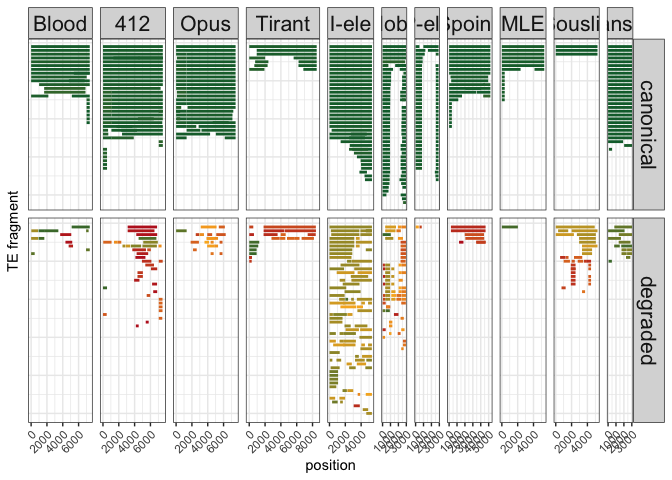

Full history of D. mel TEs in the last two centuries from long-read
assemblies
================
Almorò Scarpa

``` r
library(tidyverse)
library(svglite)
theme_set(theme_bw())
```

``` r
h<-read.csv("/Users/ascarpa/Downloads/dmel_twocenturies_local/RM_TEs/RM-readable.tsv", header=TRUE, sep = "\t")
# rm SW pid contig qstart qend strand te rstart rend score strain  len year continent lat lon
# names(h)<-c("te","chr","strand","start","end","qstart","qend","div","fraglen","telen")
names(h)<-c("rm","SW","div", "chr", "qstart","qend", "strand", "te","rstart","rend","score","strain","fraglen", "year", "continent", "lat", "lon")
h$te <- sub("Transib_Riccardo", "Transib1", h$te)
h$te <- sub("DMIFACA", "I-ele", h$te)
h$te <- sub("PPI251", "P-ele", h$te)
h$te <- sub("Micropia", "MLE", h$te)


h$telen <- ifelse(h$te == "Blood", 7410,
                  ifelse(h$te == "Tirant", 8526,
                         ifelse(h$te == "I-ele", 5371,
                                ifelse(h$te == "412", 7567,
                                       ifelse(h$te == "Hobo", 2959,
                                              ifelse(h$te == "Opus", 7521,
                                                     ifelse(h$te == "Transib1", 3030,
                                                            ifelse(h$te == "MLE", 5360,
                                                                   ifelse(h$te == "Spoink", 5216,
                                                                          ifelse(h$te == "Souslik", 5275,
                                                                                 ifelse(h$te == "P-ele", 2907, NA)))))))))))
```

Empty rows to show the facets in the final figure if the TE is missing
(like in Canton-S), this extra lines will be removed in the .svg

``` r
mock_df <- data.frame(
  rm = c("rm", "rm", "rm", "rm"),
  SW = c(67584L, 67584L, 67584L, 67584L),
  div = c(15.1, 15.1, 15.1, 15.1),
  chr = c("CM027567.1", "CM027567.1", "CM027567.1", "CM027567.1"),
  qstart = c(100000L, 100000L, 100000L, 100000L),
  qend = c(102907L, 104617L, 1045216L, 103030L),
  strand = c("C", "C", "C", "C"),
  te = c("P-ele", "MLE", "Spoink", "Transib1"),
  rstart = c(1L, 1L, 1L, 1L),
  rend = c(2907L, 5360L, 5216L, 3030L),
  score = c(0.1, 0.1, 0.1, 0.1),
  strain = c("CanS", "CanS", "CanS", "CanS"),
  fraglen = c(2907L, 4617L, 5216L, 3030L),
  year = c(1962L, 1962L, 1962L, 1962L),
  continent = c("South America", "South America", "South America", "South America"),
  lat = c(5L, 5L, 5L, 5L),
  lon = c(5L, 5L, 5L, 5L),
  telen = c(2907, 4617, 5216, 3030),
  lenfraction = c(1, 1, 1, 1),
  fragtype = c("degraded", "degraded", "degraded", "degraded")
)
```

``` r
h$lenfraction <- h$fraglen / h$telen
tp<-subset(h,fraglen>300 & div<21)
tp$fragtype="canonical"
tp[tp$div>1.5,]$fragtype="degraded"
tp <- subset(tp, strain == "TOM008")

tp$fragtype <- factor(tp$fragtype, levels=c("canonical","degraded"))
tp<-tp[order(tp$te, tp$fragtype, tp$chr, tp$qstart, decreasing = FALSE),]


if (tp$strain[1] == "CanS") {
  tp <- rbind(tp, mock_df)
}

tp$xp <- 0
tp$qstart <- as.integer(tp$qstart)
tp$telen <- as.integer(tp$telen)

c <- 0

#v2
for (i in 1:nrow(tp)) {
  if (i == 1){
    c <- 1
  } else {
    if (tp$te[i] != tp$te[i - 1]){
      c <- 1
    }
    else{
      if(tp$fragtype[i] != tp$fragtype[i - 1]) {
      c <- 1
        }
        else {
        if (tp$chr[i] == tp$chr[i - 1]){
          if ((tp$qstart[i] - tp$qstart[i-1]) < tp$telen[i]){
            c <- c - 1
          }
        }
      }
    }
  }
  tp$xp[i] <- c
  c <- c +1
}


tp$xp=-1*tp$xp
```

Sorting from longest maintaining the pairs

1)  retain th information of the pairs

``` r
tp <- mutate(tp, infopairs = paste(te, fragtype, xp, sep = ""))
```

2)  sort

``` r
tp<-tp[order(tp$te, tp$fragtype, tp$fraglen,decreasing=TRUE),]
```

3)  move the sorter of the pair in new df called tp_pair

``` r
v_infoTE <- c()
```

4)  make 2 df in s keep the second of the pair

``` r
tp_pair_l <- tp[0, ]
tp_pair_s <- tp[0, ]

for (i in 1:nrow(tp)) {
  if (tp$infopairs[i] %in% v_infoTE) {
    tp_pair_s <- rbind(tp_pair_s, tp[i, ])
  } else {
    tp_pair_l <- rbind(tp_pair_l, tp[i, ])
    v_infoTE <- c(v_infoTE, tp$infopairs[i])
  }
}
```

5)  id for visualization

``` r
tp_pair_l<-tp_pair_l %>% group_by(te,fragtype) %>% mutate(id = row_number())
tp_pair_l$id=-1*tp_pair_l$id
```

6)  Give the id to tp_infopair_s

``` r
info_id <- merge(tp_pair_s, tp_pair_l, by = "infopairs", all.x = TRUE)[, c("infopairs", "id")]
```

``` r
for (i in 1:nrow(tp_pair_s)) {
  for (k in 1:nrow(tp_pair_l)) {
  if (tp_pair_s$infopairs[i] == tp_pair_l$infopairs[k]) {
    tp_pair_s$id[i] <- tp_pair_l$id[k]}
  }
}
```

7)  Combine the two df back

``` r
new_tp <- rbind(tp_pair_l, tp_pair_s)
```

Genome size increase due to the new TEs

``` r
new_tp %>% filter(fragtype == "canonical") %>% summarise(sum(as.numeric(fraglen)))
```

    ## # A tibble: 11 × 3
    ## # Groups:   te [11]
    ##    te       fragtype  `sum(as.numeric(fraglen))`
    ##    <chr>    <fct>                          <dbl>
    ##  1 412      canonical                     206031
    ##  2 Blood    canonical                     101936
    ##  3 Hobo     canonical                      71924
    ##  4 I-ele    canonical                     160639
    ##  5 MLE      canonical                      38514
    ##  6 Opus     canonical                     181020
    ##  7 P-ele    canonical                      41862
    ##  8 Souslik  canonical                      15862
    ##  9 Spoink   canonical                      75024
    ## 10 Tirant   canonical                      40188
    ## 11 Transib1 canonical                      78997

``` r
new_tp %>% group_by(fragtype) %>% summarise(sum(as.numeric(fraglen)))
```

    ## # A tibble: 2 × 2
    ##   fragtype  `sum(as.numeric(fraglen))`
    ##   <fct>                          <dbl>
    ## 1 canonical                    1011997
    ## 2 degraded                      320703

``` r
new_tp %>% filter(fragtype == "canonical") %>% summarise(sum(as.numeric(fraglen)))
```

    ## # A tibble: 11 × 3
    ## # Groups:   te [11]
    ##    te       fragtype  `sum(as.numeric(fraglen))`
    ##    <chr>    <fct>                          <dbl>
    ##  1 412      canonical                     206031
    ##  2 Blood    canonical                     101936
    ##  3 Hobo     canonical                      71924
    ##  4 I-ele    canonical                     160639
    ##  5 MLE      canonical                      38514
    ##  6 Opus     canonical                     181020
    ##  7 P-ele    canonical                      41862
    ##  8 Souslik  canonical                      15862
    ##  9 Spoink   canonical                      75024
    ## 10 Tirant   canonical                      40188
    ## 11 Transib1 canonical                      78997

``` r
new_tp %>% group_by(fragtype) %>% summarise(sum(as.numeric(fraglen)))
```

    ## # A tibble: 2 × 2
    ##   fragtype  `sum(as.numeric(fraglen))`
    ##   <fct>                          <dbl>
    ## 1 canonical                    1011997
    ## 2 degraded                      320703

Too many small highly degraded fragments in 412 removed for readability

``` r
new_tp <- subset(new_tp, id > -51)
```

Order TEs

``` r
new_tp$te <- factor(new_tp$te, levels = c("Blood", "412", "Opus", "Tirant", "I-ele", "Hobo", "P-ele", "Spoink", "MLE", "Souslik", "Transib1"))
```

Generate and save the image

``` r
p<-ggplot(new_tp,aes(x = rstart, y = id, xend = rend, yend = id,color=div))+
  geom_segment(size=1)+facet_grid(fragtype~te,scales="free",space="free")+
  xlab("position")+ylab("TE fragment")+
  theme(axis.text.y = element_blank(), axis.ticks.y = element_blank(),
        axis.text.x = element_text(angle = 45, hjust = 1),
        strip.text = element_text(size = 16),
        legend.position = "nonw")+
  scale_colour_gradientn(colours = c("#0C6B37", "#FBB324", "#BC2023"))

plot(p)
```

<!-- -->

``` r
ggsave("/Users/ascarpa/Downloads/dmel_twocenturies_local/RM_TEs/images/TOM008.svg", plot = p, width = 18, height = 10, dpi = 300)
```
