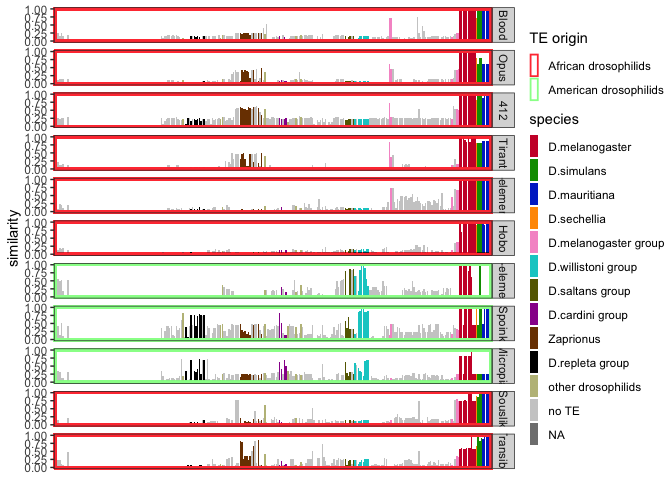

Drosophila melanogaster - TE invasions origin
================

``` r
suppressPackageStartupMessages(library(tidyverse))
suppressPackageStartupMessages(library(knitr))
suppressPackageStartupMessages(library(kableExtra))
suppressPackageStartupMessages(library(ggpubr))
suppressPackageStartupMessages(library(svglite))
theme_set(theme_bw())
```

``` r
sortorder<-c("D.flavopinicola","D.maculinotata","S.hsui","S.polygonia","S.montana","S.graminum","S.caliginosa","S.parva","S.pallida","S.reducta","S.tumidula","S.cyrtandrae","D.setosimentum","D.quasianomalipes","D.anomalipes","D.cyrtoloma","D.melanocephala","D.differens","D.planitibia","D.silvestris","D.heteroneura","D.picticornis","D.basisetae","D.paucipuncta","D.glabriapex","D.macrothrix","D.hawaiiensis","D.crucigera","D.pullipes","D.grimshawi","D.engyochracea","D.villosipedis","D.ochracea","D.murphyi","D.sproati","D.dives","D.multiciliata","D.demipolita","D.longiperda","D.melanosoma","D.fungiperda","D.mimica","D.infuscata","D.kambysellisi","D.cognata","D.tanythrix","D.yooni","D.kokeensis","D.nrfundita","D.cracens","D.paracracens","D.nigritarsus","D.nrmedialis2","D.nrmedialis3","D.seclusa","D.nrperissopoda1","D.nrperissopoda5","D.atroscutellata","D.imparisetae","D.trichaetosa","D.percnosoma","D.neutralis","D.incognita","D.sordidapex","D.conformis","D.paramelanica","D.colorata","D.robusta","D.sordidula","D.borealis","D.montana","D.lacicola","D.americana","D.virilis","D.littoralis","D.ezoana","D.kanekoi","D.pseudotalamancana","D.gaucha","D.mettleri","D.eohydei","D.pegasa","D.nigricruria","D.fulvimacula","D.peninsularis","D.paranaensis","D.repleta","D.mercatorum","D.leonis","D.anceps","D.meridiana","D.meridionalis","D.stalkeri","D.buzzatii","D.hamatofila","D.mayaguana","D.mojavensis","D.aldrichi","D.mulleri","Z.flavofinira","H.trivittata","H.alboralis","H.confusa","H.histrioides","D.repletoides","H.guttata","L.aerea","Z.bogoriensis","Z.ghesquierei","Z.inermis","Z.kolodkinae","Z.tsacasi.jd01t","Z.tsacasi.car7","Z.ornatus","Z.africanus","Z.indianus.bs02","Z.indianus.d18","Z.gabonicus","Z.indianus.r04","Z.indianus.v01","Z.capensis","Z.taronus","Z.davidi","Z.camerounensis","Z.nigranus","Z.lachaisei","Z.vittiger","D.quadrilineata","D.pruinosa","D.niveifrons","D.rubida","D.siamana","D.immigrans.12","D.immigrans.k17","D.ustulata","D.formosana","D.tripunctata","D.cardini","D.parthenogenetica","D.acutilabella","D.arawakana","D.dunni","D.macrospina","D.funebris","D.putrida","D.neotestacea","D.testacea","D.histrio","D.kuntzei","D.sp.st01m","D.phalerata","D.falleni","D.rellima","D.quinaria","D.suboccidentalis","D.recens","D.subquinaria","S.latifasciaeformis","C.caudatula","C.procnemis","C.amoena","C.costata","S.nigrithorax","L.varia","L.montana","L.maculata","C.indagator","A.minor","A.mariae","A.communis","H.duncani","L.mommai","L.collinella","L.andalusiaca","L.magnipectinata","L.clarofinis","L.stackelbergi","D.sturtevanti","D.neocordata","D.emarginata","D.saltans","D.prosaltans","D.austrosaltans","D.sucinea","D.sp.14030-0761.01","D.insularis","D.tropicalis","D.willistoni.00","D.willistoni.17","D.equinoxialis","D.paulistorum.12","D.paulistorum.06","D.subobscura","D.subsilvestris","D.obscura","D.ambigua","D.tristis","D.miranda","D.persimilis","D.pseudoobscura","D.helvetica","D.algonquin","D.affinis","D.varians","D.vallismaia","D.merina","D.ercepeae","D.atripex","D.monieri","D.anomalata","D.ananassae","D.pallidosa","D.pseuan.pseuan.","D.pseuan.nigrens","D.mal.mal.","D.mal.pallens","D.parabipectinata","D.bipectinata","D.rufa","D.triauraria","D.kikkawai","D.jambulina","D.aff.chauv.","D.bocqueti","D.birchii","D.anomelani","D.serrata","D.bunnanda","D.oshimai","D.gunungcola","D.elegans","D.fuyamai","D.kurseongensis","D.rhopaloa","D.carrolli","D.ficusphila","D.biarmipes","D.subpulchrella","D.mimetica","D.lutescens","D.takahashii","D.pseudotakahashii","D.prostipennis","D.eugracilis","D.erecta","D.yakuba","D.teissieri.273.3","D.teissieri.ct02","D.mel.ral732","D.mel.ral737","D.mel.pi2","D.mel.ral176","D.mel.ral91","D.mel.se.sto","D.mel.es.ten","D.melanogaster","D.mel.iso1","D.sechellia","D.sim.006","D.sim.sz232","D.sim.sz129","D.mau.01","D.mau.r31","D.mau.r61","D.mau.r32","D.mau.r39")
```

``` r
h <- read_tsv("/Volumes/Storage/dmel-full-story/RepeatMasker/output/merged.clean.sum.score", col_names = c("te", "species", "similarity"))
```

    ## Rows: 3192 Columns: 3
    ## ── Column specification ────────────────────────────────────────────────────────
    ## Delimiter: "\t"
    ## chr (2): te, species
    ## dbl (1): similarity
    ## 
    ## ℹ Use `spec()` to retrieve the full column specification for this data.
    ## ℹ Specify the column types or set `show_col_types = FALSE` to quiet this message.

``` r
teorder<-c("Blood", "Opus", "412", "Tirant", "DMIFACA", "Hobo", "PPI251", "Spoink", "Micropia", "Souslik", "Transib_Riccardo", "Shellder")

h$species <- factor(h$species, levels=sortorder)
h$te <- factor(h$te, levels=teorder)

p <- ggplot(h,aes(y=similarity,x=species))+
  geom_bar(stat="identity")+
  facet_grid(te~.)+
  ylab("similarity")+
  theme(axis.title.x=element_blank(),axis.text.x = element_blank())

pdf(file="/Volumes/Storage/dmel-full-story/RepeatMasker/dmel-full-story-origin.pdf",width=7,height=12)
plot(p)
dev.off()
```

    ## quartz_off_screen 
    ##                 2

``` r
ggsave("/Volumes/Storage/dmel-full-story/RepeatMasker/dmel-full-story-origin.png",p,width=7,height=12)
```

``` r
p<- ggplot(h,aes(x=similarity,y=species))+geom_bar(stat="identity")+facet_grid(.~te)+xlab("similarity")+
  theme(axis.title.y=element_blank(),axis.text.y = element_text(vjust = 0.5, hjust=1,size=4))

pdf(file="/Volumes/Storage/dmel-full-story/RepeatMasker/dmel-full-story-origin-vertical.pdf",width=12,height=12)
plot(p)
dev.off()
```

    ## quartz_off_screen 
    ##                 2

``` r
ggsave("/Volumes/Storage/dmel-full-story/RepeatMasker/dmel-full-story-origin-vertical.png",p,width=7,height=12)
```

(For Spoink revision, subset)

``` r
(h_spoink<-read_tsv("/Volumes/Storage/Dmel-spoink/REVISION/nebulosa/output/merged.clean.score", col_names = c("te", "species", "similarity")))
```

    ## Rows: 3204 Columns: 3
    ## ── Column specification ────────────────────────────────────────────────────────
    ## Delimiter: "\t"
    ## chr (2): te, species
    ## dbl (1): similarity
    ## 
    ## ℹ Use `spec()` to retrieve the full column specification for this data.
    ## ℹ Specify the column types or set `show_col_types = FALSE` to quiet this message.

    ## # A tibble: 3,204 × 3
    ##    te      species          similarity
    ##    <chr>   <chr>                 <dbl>
    ##  1 DMIFACA D.triauraria        0.304  
    ##  2 DMIFACA L.clarofinis        0.147  
    ##  3 DMIFACA D.paramelanica      0.0410 
    ##  4 DMIFACA D.macrospina        0.0259 
    ##  5 DMIFACA D.nrperissopoda5    0.00604
    ##  6 DMIFACA D.melanogaster      1      
    ##  7 DMIFACA D.engyochracea      0.00683
    ##  8 DMIFACA D.mau.r39           0.978  
    ##  9 DMIFACA Z.inermis           0.00797
    ## 10 DMIFACA Z.nigranus          0.0785 
    ## # ℹ 3,194 more rows

``` r
subset_species <- c("D.gaucha","D.leonis","D.anceps","D.meridiana","D.meridionalis","D.cardini","D.fulvimacula","D.nebulosa","D.insularis","D.tropicalis","D.willistoni.00","D.willistoni.17","D.equinoxialis","D.paulistorum.12","D.paulistorum.06","D.mel.ral732","D.mel.ral737","D.mel.pi2","D.mel.ral176","D.mel.ral91","D.mel.se.sto","D.mel.es.ten","D.melanogaster","D.mel.iso1","D.sechellia","D.sim.006","D.sim.sz129")

h_spoink$species <- factor(h_spoink$species, levels=subset_species)
h_spoink$te <- factor(h_spoink$te, levels=teorder)

spoink_rev <- h_spoink %>% filter(te=="Spoink", species %in% subset_species)

(p_spoink <- ggplot(spoink_rev,aes(x=species,y=similarity))+geom_bar(stat="identity")+ylab("similarity")+
  theme(axis.title.x = element_blank(),
        axis.text.x = element_text(angle = 90, vjust = 0.5, hjust=1)))
```

<!-- -->

``` r
ggsave("/Volumes/Storage/Dmel-spoink/REVISION/nebulosa/RM.svg", p_spoink)
```

    ## Saving 7 x 5 in image

(Anastrepha)

``` r
h_shell <- read_tsv("/Volumes/Storage/dmel-full-story/RepeatMasker/output+anastrepha/merged.clean.score", col_names = c("te", "species", "similarity"))
```

    ## Rows: 3216 Columns: 3
    ## ── Column specification ────────────────────────────────────────────────────────
    ## Delimiter: "\t"
    ## chr (2): te, species
    ## dbl (1): similarity
    ## 
    ## ℹ Use `spec()` to retrieve the full column specification for this data.
    ## ℹ Specify the column types or set `show_col_types = FALSE` to quiet this message.

``` r
sortorder_shell<-c("A.ludens","A.obliqua","D.eohydei","D.pegasa","D.nigricruria","D.fulvimacula","D.peninsularis","D.paranaensis","D.repleta","D.mercatorum","D.leonis","D.anceps","D.meridiana","D.meridionalis","D.cardini","D.parthenogenetica","D.acutilabella","D.arawakana","D.dunni","D.macrospina","D.funebris","D.putrida","D.neotestacea","D.testacea","D.histrio","D.kuntzei","D.sp.st01m","D.phalerata","D.falleni","D.rellima","D.quinaria","D.suboccidentalis","D.recens","D.subquinaria","D.sp.14030-0761.01","D.insularis","D.tropicalis","D.willistoni.00","D.willistoni.17","D.equinoxialis","D.paulistorum.12","D.paulistorum.06","D.subobscura","D.subsilvestris","D.obscura","D.ambigua","D.tristis","D.miranda","D.persimilis","D.pseudoobscura","D.helvetica","D.algonquin","D.affinis","D.varians","D.vallismaia","D.merina","D.ercepeae","D.atripex","D.monieri","D.anomalata","D.ananassae","D.eugracilis","D.erecta","D.yakuba","D.teissieri.273.3","D.teissieri.ct02","D.mel.ral732","D.mel.ral737","D.mel.pi2","D.mel.ral176","D.mel.ral91","D.mel.se.sto","D.mel.es.ten","D.melanogaster","D.mel.iso1","D.sechellia","D.sim.006","D.sim.sz232","D.sim.sz129","D.mau.01","D.mau.r31","D.mau.r61","D.mau.r32","D.mau.r39")

h_shell$species <- factor(h_shell$species, levels=sortorder_shell)
h_shell$te <- factor(h_shell$te, levels=teorder)

add <- c("A.ludens.fna.ori.out.clean","A.obliqua.fna.ori.out.clean")

(h_shell_filter <- h_shell %>% filter(te=="Shellder", species %in% sortorder_shell))
```

    ## # A tibble: 84 × 3
    ##    te       species         similarity
    ##    <fct>    <fct>                <dbl>
    ##  1 Shellder D.putrida           0.0387
    ##  2 Shellder D.miranda           0.0296
    ##  3 Shellder D.nigricruria       0.0394
    ##  4 Shellder D.sim.sz129         0.992 
    ##  5 Shellder D.mel.se.sto        0.0322
    ##  6 Shellder D.mel.iso1          0.0330
    ##  7 Shellder D.anceps            0.984 
    ##  8 Shellder D.mel.es.ten        0.0322
    ##  9 Shellder D.willistoni.17     0.889 
    ## 10 Shellder D.phalerata         0.0501
    ## # ℹ 74 more rows

``` r
(p_shell <- ggplot(h_shell_filter,aes(y=similarity,x=species))+
  geom_bar(stat="identity")+
  facet_grid(te~.)+
  ylab("similarity")+
  theme(axis.title.x = element_blank(),
        axis.text.x = element_text(angle = 90, vjust = 0.5, hjust=1)))
```

<!-- -->

For Wolfgang Miller

``` r
h <- read_tsv("/Volumes/Storage/dmel-full-story/RepeatMasker/output/merged.clean.sum.score", col_names = c("te", "species", "similarity")) %>% filter(te %in% c("PPI251","Spoink","Micropia","Shellder"))
```

    ## Rows: 3192 Columns: 3
    ## ── Column specification ────────────────────────────────────────────────────────
    ## Delimiter: "\t"
    ## chr (2): te, species
    ## dbl (1): similarity
    ## 
    ## ℹ Use `spec()` to retrieve the full column specification for this data.
    ## ℹ Specify the column types or set `show_col_types = FALSE` to quiet this message.

``` r
teorder<-c("PPI251", "Spoink", "Micropia", "Shellder")

h$species <- factor(h$species, levels=sortorder)
h$te <- factor(h$te, levels=teorder)

p <- ggplot(h,aes(y=similarity,x=species))+
  geom_bar(stat="identity")+
  facet_grid(te~.)+
  ylab("similarity")+
  theme(axis.title.x=element_blank(),axis.text.x = element_blank())

pdf(file="/Volumes/Storage/dmel-full-story/RepeatMasker/dmel-full-story-origin-america.pdf",width=9,height=7)
plot(p)
dev.off()
```

    ## quartz_off_screen 
    ##                 2

``` r
ggsave("/Volumes/Storage/dmel-full-story/RepeatMasker/dmel-full-story-origin-america.png",p,width=9,height=7)
```
