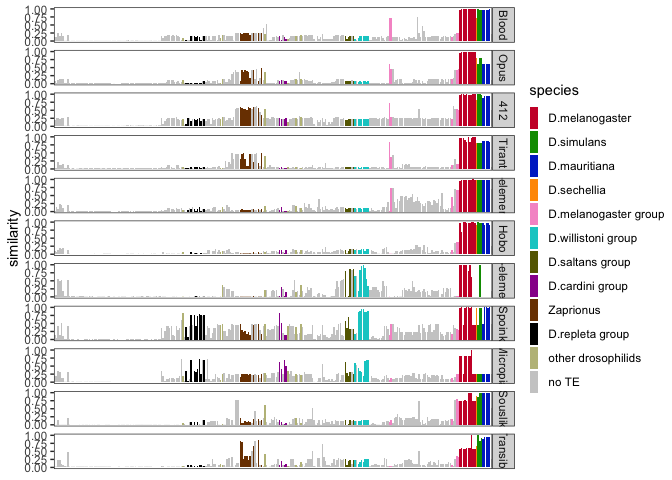

Drosophila melanogaster - TE invasions origin
================

``` r
suppressPackageStartupMessages(library(tidyverse))
suppressPackageStartupMessages(library(knitr))
suppressPackageStartupMessages(library(kableExtra))
suppressPackageStartupMessages(library(ggpubr))
suppressPackageStartupMessages(library(svglite))
theme_set(theme_bw())
```

    for i in *.ori.out; do cat $i| python ../reader-rm.py| python ../rm-cleanup.py > $i.clean; done

    for i in *ori.out.clean; do awk '{print $0,FILENAME}' $i |perl -pe 's/\.fa\.ori\.out\.clean//'; done > merged.clean.sum

    python score-max.py --rm merged.clean.sum > merged.clean.score

``` r
sortorder<-c("D.flavopinicola","D.maculinotata","S.hsui","S.polygonia","S.montana","S.graminum","S.caliginosa","S.parva","S.pallida","S.reducta","S.tumidula","S.cyrtandrae","D.setosimentum","D.quasianomalipes","D.anomalipes","D.cyrtoloma","D.melanocephala","D.differens","D.planitibia","D.silvestris","D.heteroneura","D.picticornis","D.basisetae","D.paucipuncta","D.glabriapex","D.macrothrix","D.hawaiiensis","D.crucigera","D.pullipes","D.grimshawi","D.engyochracea","D.villosipedis","D.ochracea","D.murphyi","D.sproati","D.dives","D.multiciliata","D.demipolita","D.longiperda","D.melanosoma","D.fungiperda","D.mimica","D.infuscata","D.kambysellisi","D.cognata","D.tanythrix","D.yooni","D.kokeensis","D.nrfundita","D.cracens","D.paracracens","D.nigritarsus","D.nrmedialis2","D.nrmedialis3","D.seclusa","D.nrperissopoda1","D.nrperissopoda5","D.atroscutellata","D.imparisetae","D.trichaetosa","D.percnosoma","D.neutralis","D.incognita","D.sordidapex","D.conformis","D.paramelanica","D.colorata","D.robusta","D.sordidula","D.borealis","D.montana","D.lacicola","D.americana","D.virilis","D.littoralis","D.ezoana","D.kanekoi","D.pseudotalamancana","D.gaucha","D.mettleri","D.eohydei","D.pegasa","D.nigricruria","D.fulvimacula","D.peninsularis","D.paranaensis","D.repleta","D.mercatorum","D.leonis","D.anceps","D.meridiana","D.meridionalis","D.stalkeri","D.buzzatii","D.hamatofila","D.mayaguana","D.mojavensis","D.aldrichi","D.mulleri","Z.flavofinira","H.trivittata","H.alboralis","H.confusa","H.histrioides","D.repletoides","H.guttata","L.aerea","Z.bogoriensis","Z.ghesquierei","Z.inermis","Z.kolodkinae","Z.tsacasi.jd01t","Z.tsacasi.car7","Z.ornatus","Z.africanus","Z.indianus.bs02","Z.indianus.d18","Z.gabonicus","Z.indianus.r04","Z.indianus.v01","Z.capensis","Z.taronus","Z.davidi","Z.camerounensis","Z.nigranus","Z.lachaisei","Z.vittiger","D.quadrilineata","D.pruinosa","D.niveifrons","D.rubida","D.siamana","D.immigrans.12","D.immigrans.k17","D.ustulata","D.formosana","D.tripunctata","D.cardini","D.parthenogenetica","D.acutilabella","D.arawakana","D.dunni","D.macrospina","D.funebris","D.putrida","D.neotestacea","D.testacea","D.histrio","D.kuntzei","D.sp.st01m","D.phalerata","D.falleni","D.rellima","D.quinaria","D.suboccidentalis","D.recens","D.subquinaria","S.latifasciaeformis","C.caudatula","C.procnemis","C.amoena","C.costata","S.nigrithorax","L.varia","L.montana","L.maculata","C.indagator","A.minor","A.mariae","A.communis","H.duncani","L.mommai","L.collinella","L.andalusiaca","L.magnipectinata","L.clarofinis","L.stackelbergi","D.sturtevanti","D.neocordata","D.emarginata","D.saltans","D.prosaltans","D.austrosaltans","D.sucinea","D.sp.14030-0761.01","D.insularis","D.tropicalis","D.willistoni.00","D.willistoni.17","D.equinoxialis","D.paulistorum.12","D.paulistorum.06","D.subobscura","D.subsilvestris","D.obscura","D.ambigua","D.tristis","D.miranda","D.persimilis","D.pseudoobscura","D.helvetica","D.algonquin","D.affinis","D.varians","D.vallismaia","D.merina","D.ercepeae","D.atripex","D.monieri","D.anomalata","D.ananassae","D.pallidosa","D.pseuan.pseuan.","D.pseuan.nigrens","D.mal.mal.","D.mal.pallens","D.parabipectinata","D.bipectinata","D.rufa","D.triauraria","D.kikkawai","D.jambulina","D.aff.chauv.","D.bocqueti","D.birchii","D.anomelani","D.serrata","D.bunnanda","D.oshimai","D.gunungcola","D.elegans","D.fuyamai","D.kurseongensis","D.rhopaloa","D.carrolli","D.ficusphila","D.biarmipes","D.subpulchrella","D.mimetica","D.lutescens","D.takahashii","D.pseudotakahashii","D.prostipennis","D.eugracilis","D.erecta","D.yakuba","D.teissieri.273.3","D.teissieri.ct02","D.mel.ral732","D.mel.ral737","D.mel.pi2","D.mel.ral176","D.mel.ral91","D.mel.se.sto","D.mel.es.ten","D.mel.TOM008","D.melanogaster","D.mel.iso1","D.sechellia","D.sim.006","D.sim.sz232","D.sim.sz129","D.mau.01","D.mau.r31","D.mau.r61","D.mau.r32","D.mau.r39")

teorder<-c("Blood", "Opus", "412", "Tirant", "I-element", "Hobo", "P-element", "Spoink", "Micropia", "Souslik", "Transib1")

grouporder<-c("D.melanogaster", "D.simulans", "D.mauritiana", "D.sechellia", "D.melanogaster group", "D.willistoni group", "D.saltans group", "D.cardini group", "Zaprionus", "D.repleta group", "other drosophilids", "no TE")
```

``` r
h <- read_tsv("/Volumes/Storage/dmel-full-story/RepeatMasker/output/merged.clean.score", col_names = c("te", "species", "similarity")) %>% filter(te!="Shellder") %>% mutate(te = case_when(te=="Transib_Riccardo" ~ "Transib1", te=="PPI251" ~ "P-element", te=="DMIFACA" ~ "I-element", TRUE ~ te))
```

    ## Rows: 3204 Columns: 3
    ## ── Column specification ────────────────────────────────────────────────────────
    ## Delimiter: "\t"
    ## chr (2): te, species
    ## dbl (1): similarity
    ## 
    ## ℹ Use `spec()` to retrieve the full column specification for this data.
    ## ℹ Specify the column types or set `show_col_types = FALSE` to quiet this message.

``` r
h$species <- factor(h$species, levels=sortorder)
h$te <- factor(h$te, levels=teorder)

colorcode <- read_tsv("/Volumes/Storage/dmel-full-story/TE-trees/color-code-R-groups.txt")
```

    ## Rows: 51 Columns: 4
    ## ── Column specification ────────────────────────────────────────────────────────
    ## Delimiter: "\t"
    ## chr (4): species, label, group, RGB
    ## 
    ## ℹ Use `spec()` to retrieve the full column specification for this data.
    ## ℹ Specify the column types or set `show_col_types = FALSE` to quiet this message.

``` r
colorcode$group <- factor(colorcode$group, levels=grouporder)

colorcode <- colorcode %>% arrange(group)
colors <- colorcode %>% select(RGB) %>% distinct() %>% pull()

h_color <- h %>%
  mutate(species_unique = species, species = case_when(
    grepl("^D\\.mau", species) ~ "D.mauritiana",
    grepl("^D\\.sim", species) ~ "D.simulans",
    species %in% c("D.mel.ral732","D.mel.ral737","D.mel.pi2","D.mel.ral176","D.mel.ral91","D.mel.se.sto","D.mel.es.ten","D.mel.TOM008","D.melanogaster","D.mel.iso1") ~ "D.melanogaster",
    grepl("^D\\.will", species) ~ "D.willistoni",
    grepl("^D\\.teis", species) ~ "D.teissieri",
    grepl("^D\\.pauli", species) ~ "D.paulistorum",
    grepl("^Z\\.ind", species) ~ "Z.indianus",
    TRUE ~ species)) %>%
    left_join(colorcode, by="species") %>% 
    mutate(final_group = ifelse(is.na(group), "no TE", as.character(group)), group = as.factor(final_group), ancestry = ifelse(te %in% c("P-element", "Spoink", "Micropia"), "American drosophilids", "African drosophilids"))

h_color$species <- factor(h_color$species, levels=sortorder)
h_color$te <- factor(h_color$te, levels=teorder)
h_color$group <- factor(h_color$group, levels=grouporder)

h_color
```

    ## # A tibble: 2,937 × 9
    ##    te        species     similarity species_unique label group RGB   final_group
    ##    <fct>     <fct>            <dbl> <fct>          <chr> <fct> <chr> <chr>      
    ##  1 I-element D.gunungco…     0.317  D.gunungcola   <NA>  no TE <NA>  no TE      
    ##  2 I-element D.neocorda…     0.0894 D.neocordata   D.neo D.sa… #666… D.saltans …
    ##  3 I-element D.ananassae     0.317  D.ananassae    <NA>  no TE <NA>  no TE      
    ##  4 I-element D.buzzatii      0.0738 D.buzzatii     <NA>  no TE <NA>  no TE      
    ##  5 I-element D.melanoga…     0.992  D.mel.es.ten   D.mel D.me… #CC0… D.melanoga…
    ##  6 I-element D.phalerata     0.108  D.phalerata    D.pha othe… #BEB… other dros…
    ##  7 I-element D.putrida       0.0228 D.putrida      <NA>  no TE <NA>  no TE      
    ##  8 I-element D.pseuan.n…     0.468  D.pseuan.nigr… <NA>  no TE <NA>  no TE      
    ##  9 I-element D.takahash…     0.0423 D.takahashii   <NA>  no TE <NA>  no TE      
    ## 10 I-element H.trivitta…     0.0484 H.trivittata   <NA>  no TE <NA>  no TE      
    ## # ℹ 2,927 more rows
    ## # ℹ 1 more variable: ancestry <chr>

``` r
(p <- ggplot(h_color,aes(y=similarity, x=species_unique, fill=group))+
  geom_bar(stat="identity")+
  facet_grid(te~.)+
  labs(y="similarity", fill="species")+
  scale_fill_manual(values = colors)+
  theme(axis.title.x=element_blank(), axis.text.x = element_blank(), axis.ticks.x = element_blank(), legend.key.width = unit(0.1, "in"),  # Adjust the width of legend keys
          legend.key.height = unit(0.25, "in"), # Adjust the height of legend keys
          legend.spacing.x = unit(0.1, "in"), # Adjust horizontal spacing between legend elements
          legend.spacing.y = unit(0.1, "in"), # Adjust vertical spacing between legend elements
          legend.margin = margin(0, 0, 0, 0))+
    guides(fill = guide_legend(ncol = 1))+
    theme(panel.grid.major = element_blank(),  # Remove major grid lines
        panel.grid.minor = element_blank()))
```

<!-- -->

``` r
#pdf(file="/Volumes/Storage/dmel-full-story/RepeatMasker/dmel-full-story-origin.pdf",width=7,height=12)
#plot(p)
#dev.off()

ggsave("/Volumes/Storage/dmel-full-story/figures/origin.png",p,width=7,height=9)
```

``` r
(p_color <- ggplot(h_color,aes(y=similarity, x=species_unique, fill=group))+
  geom_bar(stat="identity")+
  facet_grid(te~.)+
  labs(y="similarity", fill="species", colour="TE origin")+
  scale_fill_manual(values = colors)+
   scale_color_manual(values = c("brown1", "palegreen")) +
  theme(axis.title.x=element_blank(), axis.text.x = element_blank(), axis.ticks.x = element_blank(), legend.key.width = unit(0.1, "in"),  # Adjust the width of legend keys
          legend.key.height = unit(0.25, "in"), # Adjust the height of legend keys
          legend.spacing.x = unit(0.1, "in"), # Adjust horizontal spacing between legend elements
          legend.spacing.y = unit(0.1, "in"), # Adjust vertical spacing between legend elements
          legend.margin = margin(0, 0, 0, 0))+
    guides(fill = guide_legend(ncol = 1))+
    theme(panel.grid.major = element_blank(),  # Remove major grid lines
        panel.grid.minor = element_blank())+
   geom_rect(data = h_color,aes(color = ancestry, fill=NA), size=2, xmin = -Inf, xmax = Inf,
            ymin = -Inf, ymax = Inf, alpha = 0))
```

    ## Warning: Using `size` aesthetic for lines was deprecated in ggplot2 3.4.0.
    ## ℹ Please use `linewidth` instead.
    ## This warning is displayed once every 8 hours.
    ## Call `lifecycle::last_lifecycle_warnings()` to see where this warning was
    ## generated.

<!-- -->

``` r
#ggsave("/Volumes/Storage/dmel-full-story/figures/origin-region.png",p_color,width=7,height=9)
```

``` r
(p<- ggplot(h,aes(x=similarity,y=species))+geom_bar(stat="identity")+facet_grid(.~te)+xlab("similarity")+
  theme(axis.title.y=element_blank(),axis.text.y = element_text(vjust = 0.5, hjust=1,size=4)))
```

<!-- -->

``` r
#pdf(file="/Volumes/Storage/dmel-full-story/RepeatMasker/dmel-full-story-origin-vertical.pdf",width=12,height=12)
#plot(p)
#dev.off()

#ggsave("/Volumes/Storage/dmel-full-story/RepeatMasker/dmel-full-story-origin-vertical.png",p,width=7,height=12)
```

``` r
h %>% filter(te=="Micropia") %>% arrange(desc(similarity))
```

    ## # A tibble: 267 × 3
    ##    te       species             similarity
    ##    <fct>    <fct>                    <dbl>
    ##  1 Micropia D.mel.TOM008             1    
    ##  2 Micropia D.mel.ral176             0.827
    ##  3 Micropia D.mel.ral91              0.827
    ##  4 Micropia D.mel.se.sto             0.827
    ##  5 Micropia D.mel.ral737             0.827
    ##  6 Micropia D.mel.es.ten             0.826
    ##  7 Micropia D.mel.ral732             0.824
    ##  8 Micropia D.leonis                 0.730
    ##  9 Micropia D.pseudotalamancana      0.720
    ## 10 Micropia D.buzzatii               0.715
    ## # ℹ 257 more rows

``` r
(tom008 <- read_tsv("/Volumes/Storage/dmel-full-story/RepeatMasker/output/D.mel.TOM008.fa.ori.out.clean", col_names = c("rm","SW","pid","contig","qstart","qend","strand","te","rstart","rend","score","strain")) %>% filter(te=="Micropia") %>% arrange(desc(SW)))
```

    ## Rows: 5444 Columns: 12
    ## ── Column specification ────────────────────────────────────────────────────────
    ## Delimiter: "\t"
    ## chr (4): rm, contig, strand, te
    ## dbl (7): SW, pid, qstart, qend, rstart, rend, score
    ## lgl (1): strain
    ## 
    ## ℹ Use `spec()` to retrieve the full column specification for this data.
    ## ℹ Specify the column types or set `show_col_types = FALSE` to quiet this message.

    ## # A tibble: 412 × 12
    ##    rm       SW   pid contig qstart   qend strand te    rstart  rend score strain
    ##    <chr> <dbl> <dbl> <chr>   <dbl>  <dbl> <chr>  <chr>  <dbl> <dbl> <dbl> <lgl> 
    ##  1 rm    49866  0.28 CM034… 5.60e6 5.61e6 +      Micr…      1  5360  1    NA    
    ##  2 rm    49611  0.24 CM034… 6.49e6 6.49e6 C      Micr…      1  5360  1    NA    
    ##  3 rm    48960  0.13 CM034… 1.97e7 1.97e7 C      Micr…     12  5360  1    NA    
    ##  4 rm    46625  0.26 CM034… 1.74e7 1.74e7 +      Micr…      1  5360  1    NA    
    ##  5 rm    46138  0.21 CM034… 1.73e7 1.73e7 +      Micr…      1  5360  1    NA    
    ##  6 rm    45815  0.28 CM034… 2.86e6 2.87e6 +      Micr…      1  5360  1    NA    
    ##  7 rm    20771  0.13 CM034… 1.78e7 1.78e7 +      Micr…      1  2367  0.44 NA    
    ##  8 rm    16518  2.22 CM034… 3.03e7 3.03e7 +      Micr…      1  2026  0.38 NA    
    ##  9 rm    13528 29.2  CM034… 1.72e6 1.72e6 +      Micr…    361  4346  0.74 NA    
    ## 10 rm    13236 29.6  CM034… 2.53e7 2.53e7 C      Micr…    361  4390  0.75 NA    
    ## # ℹ 402 more rows

``` r
(ral176 <- read_tsv("/Volumes/Storage/dmel-full-story/RepeatMasker/output/D.mel.ral176.fa.ori.out.clean", col_names = c("rm","SW","pid","contig","qstart","qend","strand","te","rstart","rend","score","strain")) %>% filter(te=="Micropia") %>% arrange(desc(SW)))
```

    ## Rows: 6495 Columns: 12
    ## ── Column specification ────────────────────────────────────────────────────────
    ## Delimiter: "\t"
    ## chr (4): rm, contig, strand, te
    ## dbl (7): SW, pid, qstart, qend, rstart, rend, score
    ## lgl (1): strain
    ## 
    ## ℹ Use `spec()` to retrieve the full column specification for this data.
    ## ℹ Specify the column types or set `show_col_types = FALSE` to quiet this message.

    ## # A tibble: 293 × 12
    ##    rm       SW   pid contig qstart   qend strand te    rstart  rend score strain
    ##    <chr> <dbl> <dbl> <chr>   <dbl>  <dbl> <chr>  <chr>  <dbl> <dbl> <dbl> <lgl> 
    ##  1 rm    41246  0.07 CM034… 1.13e7 1.13e7 +      Micr…      2  4617  1    NA    
    ##  2 rm    41242  0.07 CM034… 2.64e5 2.68e5 C      Micr…      2  4617  1    NA    
    ##  3 rm    41208  0.02 CM034… 6.95e5 7.00e5 +      Micr…      1  4617  1    NA    
    ##  4 rm    41199  0.09 CM034… 1.60e7 1.60e7 +      Micr…      4  4617  1    NA    
    ##  5 rm    41176  0.15 CM034… 1.49e7 1.49e7 +      Micr…      1  4617  1    NA    
    ##  6 rm    41035  0.09 CM034… 9.24e6 9.25e6 C      Micr…      5  4617  1    NA    
    ##  7 rm    41000  0.13 CM034… 2.15e7 2.15e7 +      Micr…      1  4617  1    NA    
    ##  8 rm    40587  0.22 CM034… 2.21e6 2.21e6 +      Micr…     66  4616  0.99 NA    
    ##  9 rm    40185  0.04 CM034… 1.08e7 1.08e7 C      Micr…      6  4617  1    NA    
    ## 10 rm    38598  0.13 CM034… 2.20e6 2.20e6 +      Micr…      1  4617  1    NA    
    ## # ℹ 283 more rows

## Anastrepha

(Anastrepha)

``` r
#h_shell <- read_tsv("/Volumes/Storage/dmel-full-story/RepeatMasker/output+anastrepha/merged.clean.score", col_names = #c("te", "species", "similarity"))

#sortorder_shell<-c("A.ludens","A.obliqua","D.eohydei","D.pegasa","D.nigricruria","D.fulvimacula","D.peninsularis","D.paranaensis","D.repleta","D.mercatorum","D.leonis","D.anceps","D.meridiana","D.meridionalis","D.cardini","D.parthenogenetica","D.acutilabella","D.arawakana","D.dunni","D.macrospina","D.funebris","D.putrida","D.neotestacea","D.testacea","D.histrio","D.kuntzei","D.sp.st01m","D.phalerata","D.falleni","D.rellima","D.quinaria","D.suboccidentalis","D.recens","D.subquinaria","D.sp.14030-0761.01","D.insularis","D.tropicalis","D.willistoni.00","D.willistoni.17","D.equinoxialis","D.paulistorum.12","D.paulistorum.06","D.subobscura","D.subsilvestris","D.obscura","D.ambigua","D.tristis","D.miranda","D.persimilis","D.pseudoobscura","D.helvetica","D.algonquin","D.affinis","D.varians","D.vallismaia","D.merina","D.ercepeae","D.atripex","D.monieri","D.anomalata","D.ananassae","D.eugracilis","D.erecta","D.yakuba","D.teissieri.273.3","D.teissieri.ct02","D.mel.ral732","D.mel.ral737","D.mel.pi2","D.mel.ral176","D.mel.ral91","D.mel.se.sto","D.mel.es.ten","D.melanogaster","D.mel.iso1","D.sechellia","D.sim.006","D.sim.sz232","D.sim.sz129","D.mau.01","D.mau.r31","D.mau.r61","D.mau.r32","D.mau.r39")

#h_shell$species <- factor(h_shell$species, levels=sortorder_shell)
#h_shell$te <- factor(h_shell$te, levels=teorder)

#add <- c("A.ludens.fna.ori.out.clean","A.obliqua.fna.ori.out.clean")

#(h_shell_filter <- h_shell %>% filter(te=="Shellder", species %in% sortorder_shell))

#(p_shell <- ggplot(h_shell_filter,aes(y=similarity,x=species))+
#  geom_bar(stat="identity")+
#  facet_grid(te~.)+
#  ylab("similarity")+
#  theme(axis.title.x = element_blank(),
#        axis.text.x = element_text(angle = 90, vjust = 0.5, hjust=1)))
```
