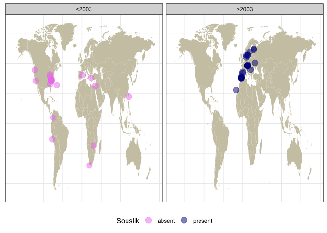

Drosophila melanogaster - TE invasions in 49 LR assemblies
================

``` r
suppressPackageStartupMessages(library(tidyverse))
suppressPackageStartupMessages(library(knitr))
suppressPackageStartupMessages(library(kableExtra))
suppressPackageStartupMessages(library(ggpubr))
suppressPackageStartupMessages(library(svglite))
theme_set(theme_bw())
```

``` r
(dmel_lr_meta <- read_tsv("/Volumes/Storage/dmel-full-story/longread-metadata.txt") %>% select(strain, year, continent, lat, lon))
```

    ## Rows: 49 Columns: 7
    ## ── Column specification ────────────────────────────────────────────────────────
    ## Delimiter: "\t"
    ## chr (4): GCA, strain, continent, location
    ## dbl (3): year, lat, lon
    ## 
    ## ℹ Use `spec()` to retrieve the full column specification for this data.
    ## ℹ Specify the column types or set `show_col_types = FALSE` to quiet this message.

    ## # A tibble: 49 × 5
    ##    strain    year continent       lat   lon
    ##    <chr>    <dbl> <chr>         <dbl> <dbl>
    ##  1 ORE       1925 North America    44  -122
    ##  2 CanS      1935 North America    40   -83
    ##  3 CanSChak  1935 North America    40   -83
    ##  4 A3        1954 Europe           41     2
    ##  5 B1        1954 North America    32   -65
    ##  6 B2        1954 Africa          -34    19
    ##  7 B3        1954 Asia             32    35
    ##  8 B6        1956 South America   -14   -76
    ##  9 A2        1962 South America     5   -74
    ## 10 A4        1963 Africa          -19    30
    ## # ℹ 39 more rows

``` r
(RM <- read_tsv("/Volumes/Storage/dmel-full-story/RepeatMasker/RM-longreads/merged.clean.sum", col_names = c("rm","SW","pid","contig","qstart","qend","strand","te","rstart","rend","score","strain")) %>% mutate(len = ifelse(qstart>qend, qstart-qend, qend-qstart), strain = gsub("D.mel.","",strain)) %>% inner_join(dmel_lr_meta, by="strain") %>% filter(te!="Shellder") %>% distinct())
```

    ## Rows: 296691 Columns: 12
    ## ── Column specification ────────────────────────────────────────────────────────
    ## Delimiter: "\t"
    ## chr (5): rm, contig, strand, te, strain
    ## dbl (7): SW, pid, qstart, qend, rstart, rend, score
    ## 
    ## ℹ Use `spec()` to retrieve the full column specification for this data.
    ## ℹ Specify the column types or set `show_col_types = FALSE` to quiet this message.

    ## # A tibble: 237,093 × 17
    ##    rm       SW   pid contig qstart   qend strand te    rstart  rend score strain
    ##    <chr> <dbl> <dbl> <chr>   <dbl>  <dbl> <chr>  <chr>  <dbl> <dbl> <dbl> <chr> 
    ##  1 rm    67584  0.18 CM010… 3.92e5 4.00e5 C      Blood      1  7410  1    A2    
    ##  2 rm     1419 35.4  CM010… 6.60e5 6.61e5 C      Tira…   3759  5056  0.15 A2    
    ##  3 rm    29612  0.19 CM010… 2.09e6 2.09e6 C      Tira…   5283  8526  0.38 A2    
    ##  4 rm    15263  0.3  CM010… 2.09e6 2.10e6 C      Tira…    744  2415  0.2  A2    
    ##  5 rm    10004  1.59 CM010… 2.09e6 2.10e6 C      Tira…      3  1139  0.13 A2    
    ##  6 rm     9936  1.76 CM010… 2.11e6 2.11e6 +      Tira…      2  1139  0.13 A2    
    ##  7 rm    10606  0.85 CM010… 2.11e6 2.11e6 +      Tira…    744  1908  0.14 A2    
    ##  8 rm    14215  0.39 CM010… 2.11e6 2.11e6 +      Tira…   6969  8526  0.18 A2    
    ##  9 rm    63428  0.16 CM010… 3.01e6 3.02e6 +      Blood      1  7410  1    A2    
    ## 10 rm    47106  0.17 CM010… 4.00e6 4.01e6 +      DMIF…      1  5365  1    A2    
    ## # ℹ 237,083 more rows
    ## # ℹ 5 more variables: len <dbl>, year <dbl>, continent <chr>, lat <dbl>,
    ## #   lon <dbl>

``` r
RM_full_len <- RM %>% filter(!(te %in% c("Hobo","PPI251","Transib_Riccardo"))) %>% select(strain, te, SW, pid, len, score, year) %>% filter(score > 0.8, pid < 1)
RM_DNA_TE <- RM %>% filter(te %in% c("Hobo","Transib_Riccardo","PPI251")) %>% select(strain, te, SW, pid, len, score, year) %>% filter(score > 0.5, pid < 1)
RM_P <- RM %>% filter(te == "PPI251") %>% select(strain, te, SW, pid, len, score, year) %>% filter(score > 0.25, pid < 1)
RM_count <- bind_rows(RM_full_len, RM_DNA_TE, RM_P)

strains <- RM %>% select(strain, year) %>% distinct()
te <- RM %>% select(te) %>% distinct()
combinations <- expand.grid(strain = strains$strain, te = te$te)
repeated_combinations <- combinations[rep(1:nrow(combinations), each = 11), ]
dummy <- as_tibble(repeated_combinations) %>% distinct() %>% inner_join(strains, by="strain")

(RM_plottable <- RM_count %>% group_by(strain, te, year) %>% summarise(insertions = n()) %>% right_join(dummy, by=c("strain","te","year")) %>% mutate(insertions = ifelse(is.na(insertions), -1, insertions)) %>% mutate(presence = ifelse(insertions>1, "present", "absent"), year = ifelse(is.na(year), 1975, year), te=ifelse(te=="Transib_Riccardo","Transib1",te)))
```

    ## `summarise()` has grouped output by 'strain', 'te'. You can override using the
    ## `.groups` argument.

    ## # A tibble: 539 × 5
    ## # Groups:   strain, te [539]
    ##    strain te       year insertions presence
    ##    <chr>  <chr>   <dbl>      <dbl> <chr>   
    ##  1 A2     412      1962         21 present 
    ##  2 A2     Blood    1962         16 present 
    ##  3 A2     DMIFACA  1962         15 present 
    ##  4 A2     Hobo     1962          1 absent  
    ##  5 A2     Opus     1962         21 present 
    ##  6 A2     Tirant   1962          9 present 
    ##  7 A3     412      1954         21 present 
    ##  8 A3     Blood    1954          8 present 
    ##  9 A3     DMIFACA  1954          8 present 
    ## 10 A3     Opus     1954         19 present 
    ## # ℹ 529 more rows

``` r
RM_plottable$te <- factor(RM_plottable$te, levels = c("Blood", "Opus", "412", "Tirant", "DMIFACA", "Hobo", "PPI251", "Spoink", "Micropia", "Souslik", "Transib1"))

insertions_plot <- ggplot(RM_plottable, aes(x=reorder(strain,year), y=insertions, fill=presence))+
  geom_bar(stat = "identity")+
    labs(x="", y="copynumber")+
    facet_wrap(~te, ncol=1)+
scale_fill_manual(values = c("darkgreen", "red"))+
    theme(axis.text.x = element_text(angle = 90, vjust = 0.5, hjust=1, size=4), legend.position = "top", legend.key.size = unit(0.2, "cm"))

ggsave("/Volumes/Storage/dmel-full-story/figures/LR-08.png", insertions_plot, height = 20)
```

    ## Saving 7 x 20 in image

``` r
(to_map <- RM_plottable %>% inner_join(dmel_lr_meta, by=c("strain","year")) %>% filter(te %in% c("Souslik","Transib1"), year>2000))
```

    ## # A tibble: 64 × 8
    ## # Groups:   strain, te [64]
    ##    strain te        year insertions presence continent   lat   lon
    ##    <chr>  <fct>    <dbl>      <dbl> <chr>    <chr>     <dbl> <dbl>
    ##  1 AKA017 Souslik   2015          5 present  Europe       62    29
    ##  2 AKA018 Souslik   2015          5 present  Europe       62    29
    ##  3 COR014 Souslik   2015          5 present  Europe       38    -3
    ##  4 COR018 Souslik   2015          2 present  Europe       38    -3
    ##  5 COR018 Transib1  2015         19 present  Europe       38    -3
    ##  6 COR023 Souslik   2015          4 present  Europe       38    -3
    ##  7 COR023 Transib1  2015          5 present  Europe       38    -3
    ##  8 COR025 Souslik   2015          6 present  Europe       38    -3
    ##  9 COR025 Transib1  2015         18 present  Europe       38    -3
    ## 10 GIM012 Souslik   2015          2 present  Europe       42     0
    ## # ℹ 54 more rows

``` r
to_map$presence <- factor(to_map$presence, levels = c("present", "absent"))

world_map <- map_data("world")
world_map <- subset(world_map, region != "Antarctica")

(lr_map <- ggplot() +
    geom_map(data = world_map, map = world_map,
             aes(long, lat, map_id = region),
             color = "white", fill = "cornsilk3", linewidth = 0) +
   geom_point(data = to_map, aes(x = lon, y = lat, color = presence), size = 4, position = position_jitter(width = 2, height = 2), alpha = 0.25) +
   scale_colour_manual(values = c("red", "darkgreen")) +
  theme(plot.title = element_text(hjust = 0.5), axis.text = element_blank(), axis.title = element_blank(), axis.ticks = element_blank(), legend.position = "bottom") +
  facet_wrap(~te*year) +
    ggtitle("Long reads assemblies"))
```

    ## Warning in geom_map(data = world_map, map = world_map, aes(long, lat, map_id =
    ## region), : Ignoring unknown aesthetics: x and y

<!-- -->
