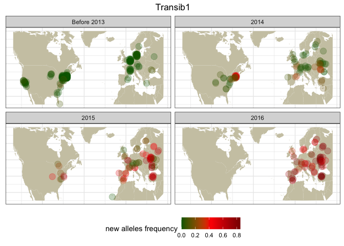

Drosophila melanogaster - TE invasions maps
================

``` r
suppressPackageStartupMessages(library(tidyverse))
suppressPackageStartupMessages(library(knitr))
suppressPackageStartupMessages(library(kableExtra))
suppressPackageStartupMessages(library(ggpubr))
suppressPackageStartupMessages(library(svglite))
theme_set(theme_bw())
```

## File import

Read metadata and copynumber estimates

``` r
invaders <- read_tsv("/Volumes/Storage/dmel-full-story/dataset.tsv", show_col_types = FALSE) %>% mutate(presence = ifelse(HQ_reads>=2.5, "present", "absent"))

HT_estimates <- tibble(
  TE = c("Blood", "Opus", "412", "Tirant", "I-element", "Hobo", "P-element", "Spoink", "Micropia", "Souslik", "Transib1"),
  HT = c(1900, 1900, 1900, 1935, 1950, 1960, 1965, 1985, 1985, 2005, 2010))

(invaders_meta <- inner_join(invaders, HT_estimates, by="TE") %>% mutate(new_alleles = ifelse(reinvasion==TRUE, new_alleles, ifelse(HQ_reads > 1, 1, 0))))
```

    ## # A tibble: 6,413 × 16
    ##    Sample     TE    All_reads HQ_reads new_alleles reinvasion strain publication
    ##    <chr>      <chr>     <dbl>    <dbl>       <dbl> <lgl>      <chr>  <chr>      
    ##  1 ERR6474638 412       52.3     42.6     0.956    TRUE       Orego… https://do…
    ##  2 ERR6474638 Blood     28.6     25.1     0.863    TRUE       Orego… https://do…
    ##  3 ERR6474638 I-el…     17.9     13.3     0.00531  TRUE       Orego… https://do…
    ##  4 ERR6474638 Hobo       4.06     2.13    0.000458 TRUE       Orego… https://do…
    ##  5 ERR6474638 Micr…      0.1      0       0.00266  TRUE       Orego… https://do…
    ##  6 ERR6474638 Opus      22.7     18.8     1        FALSE      Orego… https://do…
    ##  7 ERR6474638 P-el…      0        0       0        FALSE      Orego… https://do…
    ##  8 ERR6474638 Sous…      3.15     2.1     0.00231  TRUE       Orego… https://do…
    ##  9 ERR6474638 Spoi…      0.83     0.1     0.000187 TRUE       Orego… https://do…
    ## 10 ERR6474638 Tira…      0.48     0.08    0.00107  TRUE       Orego… https://do…
    ## # ℹ 6,403 more rows
    ## # ℹ 8 more variables: study <chr>, study_id <chr>, year <dbl>, location <chr>,
    ## #   lat <dbl>, lon <dbl>, presence <chr>, HT <dbl>

``` r
invaders_meta$TE <- factor(invaders_meta$TE, levels = c("Blood", "Opus", "412", "Tirant", "I-element", "Hobo", "P-element", "Spoink", "Micropia", "Souslik", "Transib1"))
```

## Maps

``` r
world_map <- map_data("world") %>% filter(region != "Antarctica")
naeu_map <- world_map %>% filter(lat > 25 & lat < 70, long > -135 & long < 45)
europe_map <- world_map %>% filter(lat > 36 & lat < 70, long > -10 & long < 40)
```

## Transib

``` r
transib_data <- invaders_meta %>% filter(TE=="Transib1") %>% mutate(year = ifelse(year>2013, year, "<2013"))
```

World map

``` r
(transib_map_world <- ggplot() +
    geom_map(data = world_map, map = world_map, aes(long, lat, map_id = region), color = "white", fill = "cornsilk3", linewidth = 0) +
    geom_point(data = transib_data, aes(x = lon, y = lat, color = new_alleles), size = 4, position = position_jitter(width = 2, height = 2), alpha = 0.25) +
    scale_color_gradientn(colours=c("darkgreen","red","darkred"))+
    theme(plot.title = element_text(hjust = 0.5), axis.text = element_blank(), axis.title = element_blank(), axis.ticks = element_blank(), legend.position = "bottom") +
    facet_wrap(~year) +
    labs(color="new alleles frequency") +
    ggtitle("Transib1"))
```

    ## Warning in geom_map(data = world_map, map = world_map, aes(long, lat, map_id =
    ## region), : Ignoring unknown aesthetics: x and y

    ## Warning: Removed 2 rows containing missing values (`geom_point()`).

<!-- -->

NA+EU maps

``` r
transib_naeu <- transib_data %>% filter(lat > 25 & lat < 70, lon > -135 & lon < 45)

(transib_map_snps <- ggplot() +
    geom_map(data = naeu_map, map = naeu_map,
             aes(long, lat, map_id = region),
             color = "white", fill = "cornsilk3", linewidth = 0) +
   geom_point(data = transib_naeu, aes(x = lon, y = lat, color = new_alleles), size = 4, position = position_jitter(width = 1, height = 1), alpha = 0.25) +
   scale_color_gradientn(colours=c("darkgreen","red","darkred"), breaks = c(0,0.2,0.4,0.6,0.8,1))+
  theme(plot.title = element_text(hjust = 0.5), axis.text = element_blank(), axis.title = element_blank(), axis.ticks = element_blank(), legend.position = "bottom") +
  facet_wrap(~year) +
    labs(color="new alleles frequency") +
    ggtitle("Transib1"))
```

    ## Warning in geom_map(data = naeu_map, map = naeu_map, aes(long, lat, map_id =
    ## region), : Ignoring unknown aesthetics: x and y

<!-- -->

EU map

``` r
transib_eu <- transib_data %>% filter(lat > 36 & lat < 70, lon > -10 & lon < 40)

(transib_map_eu <- ggplot() +
    geom_map(data = europe_map, map = europe_map,
             aes(long, lat, map_id = region),
             color = "white", fill = "cornsilk3", linewidth = 0) +
   geom_point(data = transib_eu, aes(x = lon, y = lat, color = new_alleles), size = 4, position = position_jitter(width = 1, height = 1), alpha = 0.25) +
   scale_color_gradientn(colours=c("darkgreen","red","darkred"), breaks = c(0,0.2,0.4,0.6,0.8,1))+
  theme(plot.title = element_text(hjust = 0.5), axis.text = element_blank(), axis.title = element_blank(), axis.ticks = element_blank(), legend.position = "bottom") +
  facet_wrap(~year) +
    labs(color="new alleles frequency") +
    ggtitle("Transib1"))
```

    ## Warning in geom_map(data = europe_map, map = europe_map, aes(long, lat, :
    ## Ignoring unknown aesthetics: x and y

<!-- -->

## Souslik

``` r
souslik_data <- invaders_meta %>% filter(TE=="Souslik") %>% mutate(year = as.character(year), year = case_when(year < 2009 ~ "<2009", year %in% c("2009","2010") ~ "2009-2010", year %in% c("2011","2012","2013","2014") ~ "2011-2014", year %in% c("2015","2016") ~ "2015-2016"))
```

World map

``` r
(souslik_map_world <- ggplot() +
    geom_map(data = world_map, map = world_map, aes(long, lat, map_id = region), color = "white", fill = "cornsilk3", linewidth = 0) +
    geom_point(data = souslik_data, aes(x = lon, y = lat, color = new_alleles), size = 4, position = position_jitter(width = 2, height = 2), alpha = 0.25) +
    scale_color_gradientn(colours=c("darkgreen","red","darkred"))+
    theme(plot.title = element_text(hjust = 0.5), axis.text = element_blank(), axis.title = element_blank(), axis.ticks = element_blank(), legend.position = "bottom") +
    facet_wrap(~year) +
    labs(color="new alleles frequency") +
    ggtitle("Souslik"))
```

    ## Warning in geom_map(data = world_map, map = world_map, aes(long, lat, map_id =
    ## region), : Ignoring unknown aesthetics: x and y

    ## Warning: Removed 2 rows containing missing values (`geom_point()`).

<!-- -->
