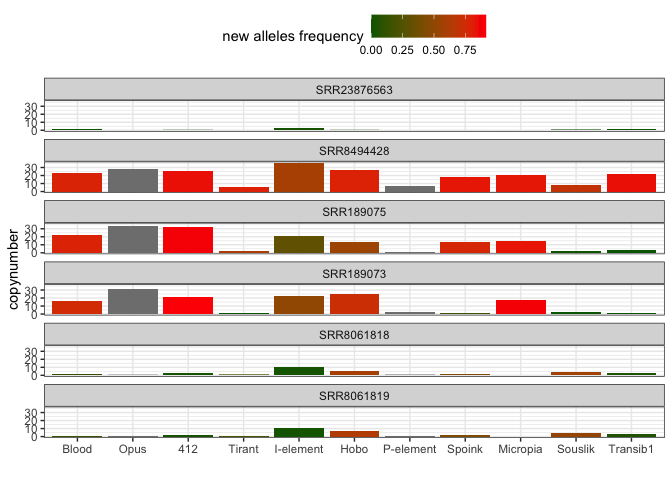
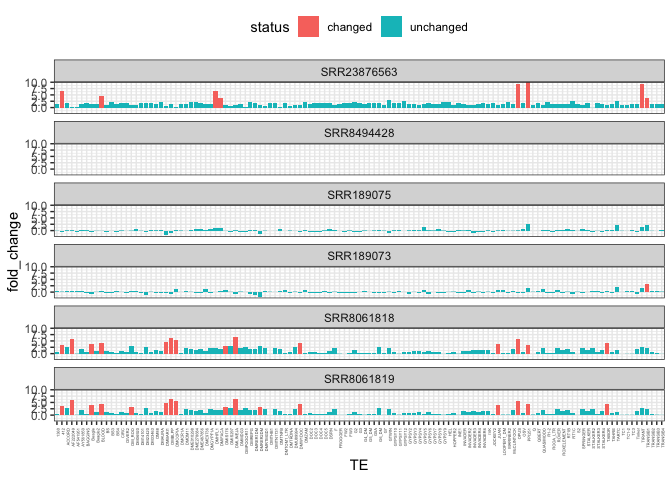

Drosophila melanogaster - TE invasions timing - outliers
================

``` r
suppressPackageStartupMessages(library(tidyverse))
suppressPackageStartupMessages(library(knitr))
suppressPackageStartupMessages(library(kableExtra))
suppressPackageStartupMessages(library(ggpubr))
suppressPackageStartupMessages(library(svglite))
theme_set(theme_bw())
```

## File import

Read metadata and copynumber estimates

``` r
(invaders <- read_tsv("/Volumes/Storage/dmel-full-story/dataset.tsv", show_col_types = FALSE) %>% mutate(presence = ifelse(HQ_reads>=2.5, "present", "absent")))
```

    ## # A tibble: 6,413 × 15
    ##    Sample     TE    All_reads HQ_reads new_alleles reinvasion strain publication
    ##    <chr>      <chr>     <dbl>    <dbl>       <dbl> <lgl>      <chr>  <chr>      
    ##  1 ERR6474638 412       52.3     42.6     0.956    TRUE       Orego… https://do…
    ##  2 ERR6474638 Blood     28.6     25.1     0.863    TRUE       Orego… https://do…
    ##  3 ERR6474638 I-el…     17.9     13.3     0.00531  TRUE       Orego… https://do…
    ##  4 ERR6474638 Hobo       4.06     2.13    0.000458 TRUE       Orego… https://do…
    ##  5 ERR6474638 Micr…      0.1      0       0.00266  TRUE       Orego… https://do…
    ##  6 ERR6474638 Opus      22.7     18.8    NA        FALSE      Orego… https://do…
    ##  7 ERR6474638 P-el…      0        0      NA        FALSE      Orego… https://do…
    ##  8 ERR6474638 Sous…      3.15     2.1     0.00231  TRUE       Orego… https://do…
    ##  9 ERR6474638 Spoi…      0.83     0.1     0.000187 TRUE       Orego… https://do…
    ## 10 ERR6474638 Tira…      0.48     0.08    0.00107  TRUE       Orego… https://do…
    ## # ℹ 6,403 more rows
    ## # ℹ 7 more variables: study <chr>, study_id <chr>, year <dbl>, location <chr>,
    ## #   lat <dbl>, lon <dbl>, presence <chr>

``` r
HT_estimates <- tibble(
  TE = c("Blood", "Opus", "412", "Tirant", "I-element", "Hobo", "P-element", "Spoink", "Micropia", "Souslik", "Transib1"),
  HT = c(1900, 1900, 1900, 1935, 1950, 1960, 1965, 1985, 1985, 2005, 2010))

invaders_meta <- inner_join(invaders, HT_estimates, by="TE")
  
invaders_meta$TE <- factor(invaders_meta$TE, levels = c("Blood", "Opus", "412", "Tirant", "I-element", "Hobo", "P-element", "Spoink", "Micropia", "Souslik", "Transib1"))
```

## Outliers extraction

Looking at the diagnostic SNPs plots and the timelines, I noticed some
outliers, which I identify here:

- 2 USA outliers (2014): \*\* SRR8061818 \*\* SRR8061818
- 2 AFR outliers (2008): \*\* SRR189073 \*\* SRR189075

``` r
outliers_detection_snps <- invaders_meta %>% filter(reinvasion==TRUE, new_alleles<0.3, year>1960, TE!="Transib1", TE!="Souslik") %>% arrange(year)

outliers_detection_cn <- invaders_meta %>% filter(reinvasion==FALSE, HQ_reads<2.5, year>1995, TE!="Transib1", TE!="Souslik") %>% arrange(year)

(outliers <- invaders_meta %>% filter(Sample %in% c("SRR23876563", "SRR8494428", "SRR189075", "SRR189073", "SRR8061818", "SRR8061819")))
```

    ## # A tibble: 66 × 16
    ##    Sample    TE     All_reads HQ_reads new_alleles reinvasion strain publication
    ##    <chr>     <fct>      <dbl>    <dbl>       <dbl> <lgl>      <chr>  <chr>      
    ##  1 SRR189073 412        27.6     20.8        0.914 TRUE       ED55-… https://do…
    ##  2 SRR189073 Blood      20.2     16.8        0.753 TRUE       ED55-… https://do…
    ##  3 SRR189073 I-ele…     26.4     22.5        0.500 TRUE       ED55-… https://do…
    ##  4 SRR189073 Hobo       27       24.6        0.729 TRUE       ED55-… https://do…
    ##  5 SRR189073 Micro…     21.9     17.4        0.879 TRUE       ED55-… https://do…
    ##  6 SRR189073 Opus      175.      31.0       NA     FALSE      ED55-… https://do…
    ##  7 SRR189073 P-ele…      2.1      1.96      NA     FALSE      ED55-… https://do…
    ##  8 SRR189073 Sousl…      4.2      2.85       0     TRUE       ED55-… https://do…
    ##  9 SRR189073 Spoink    135.       0.97       0.163 TRUE       ED55-… https://do…
    ## 10 SRR189073 Tirant      2.47     1.74       0     TRUE       ED55-… https://do…
    ## # ℹ 56 more rows
    ## # ℹ 8 more variables: study <chr>, study_id <chr>, year <dbl>, location <chr>,
    ## #   lat <dbl>, lon <dbl>, presence <chr>, HT <dbl>

``` r
outliers$Sample <- factor(outliers$Sample, levels = c("SRR23876563", "SRR8494428", "SRR189075", "SRR189073", "SRR8061818", "SRR8061819"))

(outliers_p <- ggplot(outliers, aes(x=TE, y=HQ_reads, fill=new_alleles))+
  geom_bar(stat="identity")+
    scale_fill_gradient(low="darkgreen", high = "red")+
  facet_wrap(~Sample, ncol = 1)+
    labs(x="", y="copynumber", fill = "new alleles frequency")+
    theme(legend.position = "top"))
```

<!-- -->

``` r
ggsave("/Volumes/Storage/dmel-full-story/figures/outliers.png", plot = outliers_p, height = 12)
```

    ## Saving 7 x 12 in image

``` r
outliers_bergman <- read_csv("/Volumes/Storage/dmel-full-story/analysis/outliers/outliers-dmelTEs.csv") %>% filter(Sample!="Sample") %>% type_convert()
```

    ## Rows: 1085 Columns: 4
    ## ── Column specification ────────────────────────────────────────────────────────
    ## Delimiter: ","
    ## chr (4): Sample, TE, All_reads, HQ_reads
    ## 
    ## ℹ Use `spec()` to retrieve the full column specification for this data.
    ## ℹ Specify the column types or set `show_col_types = FALSE` to quiet this message.
    ## 
    ## ── Column specification ────────────────────────────────────────────────────────
    ## cols(
    ##   Sample = col_character(),
    ##   TE = col_character(),
    ##   All_reads = col_double(),
    ##   HQ_reads = col_double()
    ## )

``` r
outliers_bergman$Sample <- factor(outliers_bergman$Sample, levels = c("SRR23876563", "SRR8494428", "SRR189075", "SRR189073", "SRR8061818", "SRR8061819"))

outliers_positive_control <- outliers_bergman %>% filter(Sample=="SRR8494428") %>% mutate(positive_control = HQ_reads) %>% select(TE, positive_control) %>% filter(positive_control>1)

(fold_enrichment <- outliers_bergman %>% inner_join(outliers_positive_control, by="TE") %>% mutate(fold_change = log2(positive_control/HQ_reads), status = ifelse(fold_change >= 3, "changed", "unchanged")))
```

    ## # A tibble: 738 × 7
    ##    Sample    TE         All_reads HQ_reads positive_control fold_change status  
    ##    <fct>     <chr>          <dbl>    <dbl>            <dbl>       <dbl> <chr>   
    ##  1 SRR189073 GYPSY6         19.8     17.6             10.2      -0.796  unchang…
    ##  2 SRR189073 HEL             7.29     5.66             5.93      0.0672 unchang…
    ##  3 SRR189073 FW2             6.05     5.24             3.91     -0.422  unchang…
    ##  4 SRR189073 DMREPG         18.7     17.1             11.5      -0.575  unchang…
    ##  5 SRR189073 OSV             5.22     3.26             2.47     -0.400  unchang…
    ##  6 SRR189073 DM23420        34.0     30.9             14.5      -1.09   unchang…
    ##  7 SRR189073 STALKER        23.8      2.99             2.94     -0.0243 unchang…
    ##  8 SRR189073 AF222049       14       11.0             16.7       0.600  unchang…
    ##  9 SRR189073 412            27.4     22.6             25.5       0.174  unchang…
    ## 10 SRR189073 DMTOM1_LTR      7.66     5.08            10.1       0.990  unchang…
    ## # ℹ 728 more rows

``` r
(changes <- fold_enrichment %>% filter(status=="changed"))
```

    ## # A tibble: 39 × 7
    ##    Sample      TE       All_reads HQ_reads positive_control fold_change status 
    ##    <fct>       <chr>        <dbl>    <dbl>            <dbl>       <dbl> <chr>  
    ##  1 SRR189073   TRANSIB1      2.52     2.16            19.3         3.16 changed
    ##  2 SRR23876563 PPI251        0        0                7.21      Inf    changed
    ##  3 SRR23876563 DMHFL1        1.2      0.28            26.4         6.56 changed
    ##  4 SRR23876563 BLOOD         2.13     1.08            22.6         4.38 changed
    ##  5 SRR23876563 DMIFACA       8.63     2.5             31.5         3.65 changed
    ##  6 SRR23876563 TIRANT        0.12     0.01             5.51        9.11 changed
    ##  7 SRR23876563 OPUS          0.52     0.04            28.4         9.47 changed
    ##  8 SRR23876563 412           0.85     0.28            25.5         6.51 changed
    ##  9 SRR23876563 TRANSIB1      3.23     1.52            19.3         3.67 changed
    ## 10 SRR8061818  DMBLPP        0.41     0.3             20.9         6.12 changed
    ## # ℹ 29 more rows

``` r
(plot_outliers_fold <- ggplot(fold_enrichment, aes(x=TE, y=fold_change, fill=status))+
  geom_bar(stat="identity")+
  facet_wrap(~Sample, ncol = 1)+
  theme(legend.position = "top", 
        axis.text.x = element_text(angle = 90, hjust = 1, size = 3)))
```

<!-- -->
