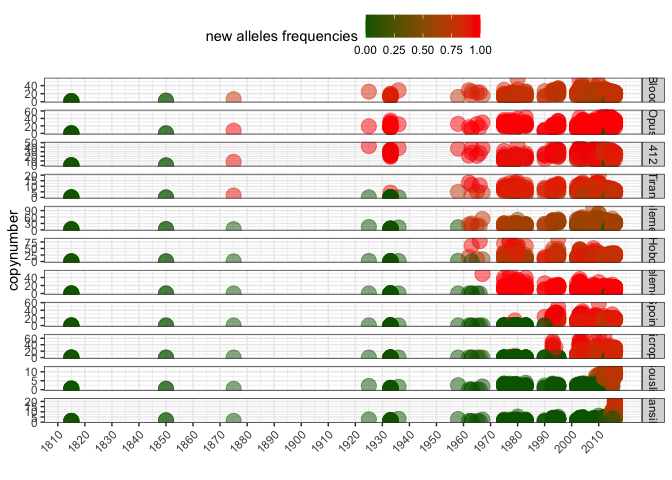

Drosophila melanogaster - TE invasions timing
================

``` r
suppressPackageStartupMessages(library(tidyverse))
suppressPackageStartupMessages(library(knitr))
suppressPackageStartupMessages(library(kableExtra))
suppressPackageStartupMessages(library(ggpubr))
suppressPackageStartupMessages(library(svglite))
theme_set(theme_bw())
```

## File import

Read metadata and copynumber estimates

``` r
invaders <- read_tsv("/Volumes/Storage/dmel-full-story/dataset.tsv", show_col_types = FALSE) %>% mutate(presence = ifelse(HQ_reads>=2.5, "present", "absent"))

HT_estimates <- tibble(
  TE = c("Blood", "Opus", "412", "Tirant", "I-element", "Hobo", "P-element", "Spoink", "Micropia", "Souslik", "Transib1"),
  HT = c(1900, 1900, 1900, 1935, 1950, 1960, 1965, 1985, 1985, 2005, 2010))

(invaders_meta <- inner_join(invaders, HT_estimates, by="TE") %>% mutate(new_alleles = ifelse(reinvasion==TRUE, new_alleles, ifelse(HQ_reads > 1, 1, 0))))
```

    ## # A tibble: 6,413 × 16
    ##    Sample     TE    All_reads HQ_reads new_alleles reinvasion strain publication
    ##    <chr>      <chr>     <dbl>    <dbl>       <dbl> <lgl>      <chr>  <chr>      
    ##  1 ERR6474638 412       52.3     42.6     0.956    TRUE       Orego… https://do…
    ##  2 ERR6474638 Blood     28.6     25.1     0.863    TRUE       Orego… https://do…
    ##  3 ERR6474638 I-el…     17.9     13.3     0.00531  TRUE       Orego… https://do…
    ##  4 ERR6474638 Hobo       4.06     2.13    0.000458 TRUE       Orego… https://do…
    ##  5 ERR6474638 Micr…      0.1      0       0.00266  TRUE       Orego… https://do…
    ##  6 ERR6474638 Opus      22.7     18.8     1        FALSE      Orego… https://do…
    ##  7 ERR6474638 P-el…      0        0       0        FALSE      Orego… https://do…
    ##  8 ERR6474638 Sous…      3.15     2.1     0.00231  TRUE       Orego… https://do…
    ##  9 ERR6474638 Spoi…      0.83     0.1     0.000187 TRUE       Orego… https://do…
    ## 10 ERR6474638 Tira…      0.48     0.08    0.00107  TRUE       Orego… https://do…
    ## # ℹ 6,403 more rows
    ## # ℹ 8 more variables: study <chr>, study_id <chr>, year <dbl>, location <chr>,
    ## #   lat <dbl>, lon <dbl>, presence <chr>, HT <dbl>

``` r
invaders_meta$TE <- factor(invaders_meta$TE, levels = c("Blood", "Opus", "412", "Tirant", "I-element", "Hobo", "P-element", "Spoink", "Micropia", "Souslik", "Transib1"))
```

## Timeline

Plot copynumbers in timelines.

``` r
invading <- invaders_meta %>% filter(reinvasion==FALSE)

timeline_invading <- ggplot(invading, aes(x=year, y=HQ_reads, color=presence)) + geom_point(alpha=0.5, size=5) +
    labs(y = "copynumber", x = "") +
    scale_x_continuous(breaks = seq(1800, max(invaders_meta$year), by = 10), labels = seq(1800, max(invaders_meta$year), by = 10))+
    scale_color_manual(values=c("darkgreen","red"))+
    facet_grid(TE ~ .)+
    #geom_vline(xintercept = timeline$HT, 
    #         linetype = "dashed", color = "red") +
    theme(legend.position = "top", 
        axis.text.x = element_text(angle = 45, hjust = 1))

reinvading <- invaders_meta %>% filter(reinvasion==TRUE)

timeline_reinvading <- ggplot(reinvading, aes(x=year, y=new_alleles, color=new_alleles)) + geom_point(alpha=0.5, size=5) +
    labs(y = "new alleles frequency", x = "") +
    scale_x_continuous(breaks = seq(1800, max(invaders_meta$year), by = 10), labels = seq(1800, max(invaders_meta$year), by = 10))+
    scale_color_gradient(low="darkgreen",high="red")+
    facet_grid(TE ~ .)+
    #geom_vline(xintercept = timeline$HT, 
    #         linetype = "dashed", color = "red") +
    theme(legend.position = "none", 
        axis.text.x = element_text(angle = 45, hjust = 1))
```

``` r
(timeline_combined <- ggplot(invaders_meta, aes(x=year, y=HQ_reads, color=new_alleles)) + geom_point(alpha=0.5, size=5) +
    labs(y = "copynumber", x = "", color = "new alleles frequencies") +
    scale_x_continuous(breaks = seq(1800, max(invaders_meta$year), by = 10), labels = seq(1800, max(invaders_meta$year), by = 10))+
    scale_color_gradient(low="darkgreen",high="red")+
    facet_grid(TE ~ ., scales = "free_y")+
    #geom_vline(xintercept = timeline$HT, 
    #         linetype = "dashed", color = "red") +
    theme(legend.position = "top", 
        axis.text.x = element_text(angle = 45, hjust = 1)))
```

<!-- -->

``` r
ggsave("/Volumes/Storage/dmel-full-story/figures/shortreads.png", plot = timeline_combined, height = 12)
```

    ## Saving 7 x 12 in image
