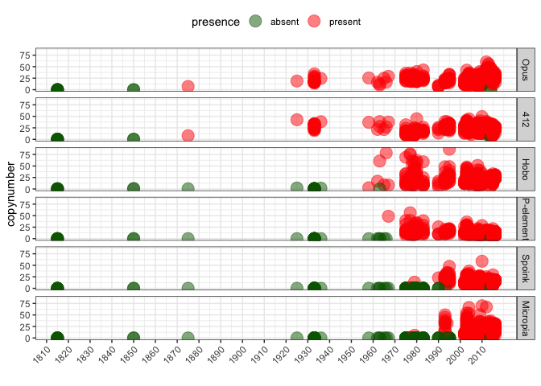
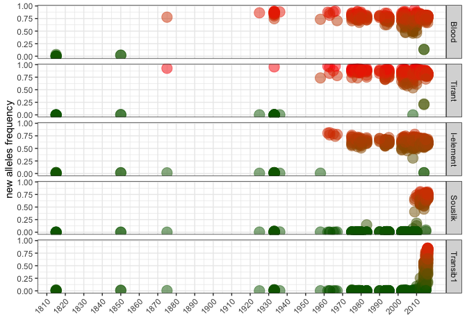
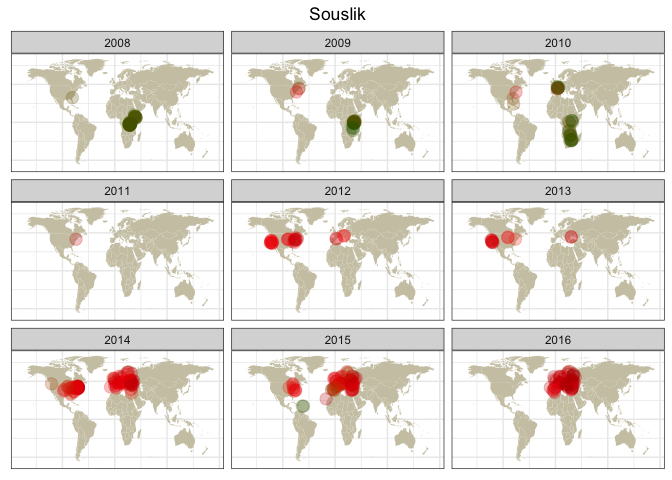
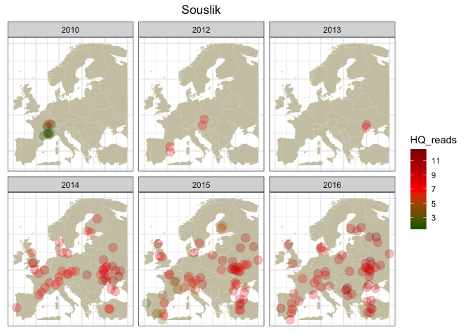
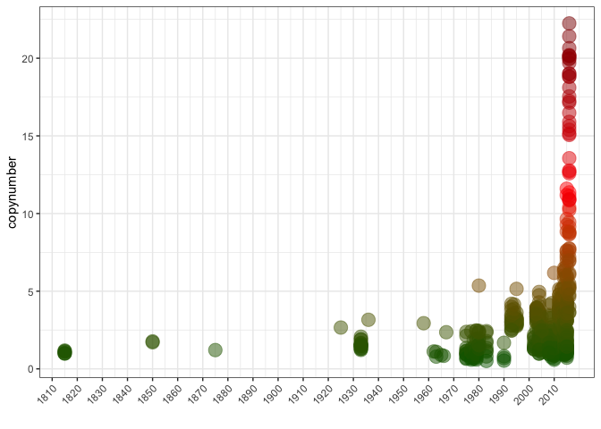
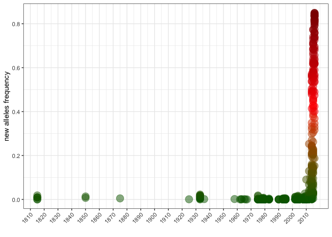
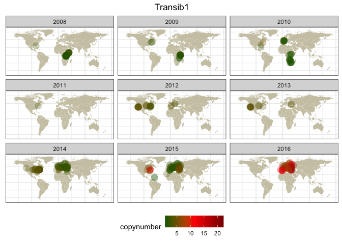
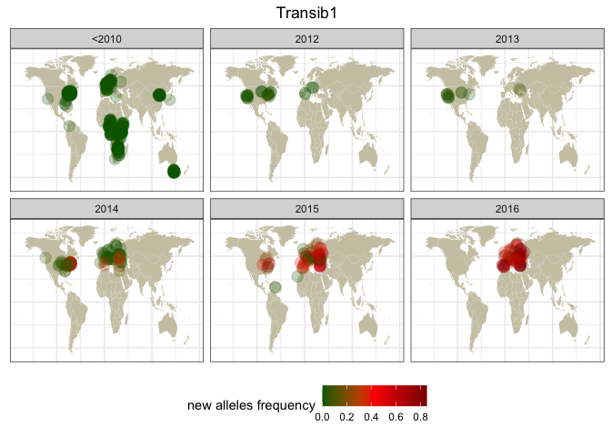
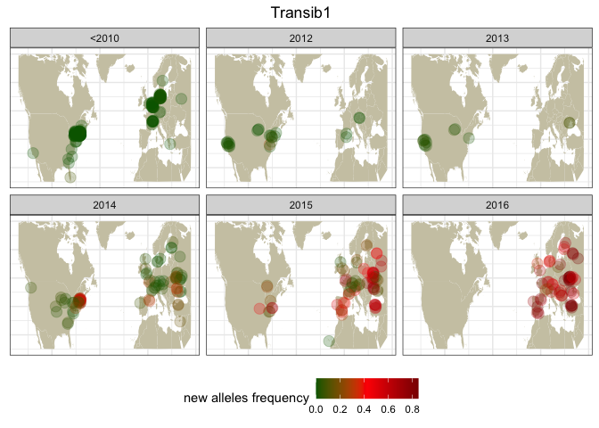

Drosophila melanogaster - TE invasions timing
================

``` r
suppressPackageStartupMessages(library(tidyverse))
suppressPackageStartupMessages(library(knitr))
suppressPackageStartupMessages(library(kableExtra))
suppressPackageStartupMessages(library(ggpubr))
suppressPackageStartupMessages(library(svglite))
theme_set(theme_bw())
```

## File import

Read metadata and copynumber estimates

``` r
(invaders <- read_tsv("/Volumes/Storage/dmel-full-story/dataset.tsv", show_col_types = FALSE) %>% mutate(presence = ifelse(HQ_reads>=2.5, "present", "absent")))
```

    ## # A tibble: 6,996 × 15
    ##    Sample     TE    All_reads HQ_reads new_alleles reinvasion strain publication
    ##    <chr>      <chr>     <dbl>    <dbl>       <dbl> <lgl>      <chr>  <chr>      
    ##  1 ERR6474638 412       52.3     42.6     NA       FALSE      Orego… https://do…
    ##  2 ERR6474638 Blood     28.6     25.1      0.863   TRUE       Orego… https://do…
    ##  3 ERR6474638 I-el…     17.9     13.3      0.00531 TRUE       Orego… https://do…
    ##  4 ERR6474638 Hobo       4.06     2.13    NA       FALSE      Orego… https://do…
    ##  5 ERR6474638 Micr…      0.1      0       NA       FALSE      Orego… https://do…
    ##  6 ERR6474638 Opus      22.7     18.8     NA       FALSE      Orego… https://do…
    ##  7 ERR6474638 P-el…      0        0       NA       FALSE      Orego… https://do…
    ##  8 ERR6474638 Shel…      0.13     0.01    NA       FALSE      Orego… https://do…
    ##  9 ERR6474638 Sous…      3.15     2.1      0.00231 TRUE       Orego… https://do…
    ## 10 ERR6474638 Spoi…      0.83     0.1     NA       FALSE      Orego… https://do…
    ## # ℹ 6,986 more rows
    ## # ℹ 7 more variables: study <chr>, study_id <chr>, year <dbl>, location <chr>,
    ## #   lat <dbl>, lon <dbl>, presence <chr>

``` r
HT_estimates <- tibble(
  TE = c("Blood", "Opus", "412", "Tirant", "I-element", "Hobo", "P-element", "Spoink", "Micropia", "Souslik", "Transib1"),
  HT = c(1900, 1900, 1900, 1935, 1950, 1960, 1965, 1985, 1985, 2005, 2010))

invaders_meta <- inner_join(invaders, HT_estimates, by="TE")
  
invaders_meta$TE <- factor(invaders_meta$TE, levels = c("Blood", "Opus", "412", "Tirant", "I-element", "Hobo", "P-element", "Spoink", "Micropia", "Souslik", "Transib1"))
```

## Timeline

Plot copynumbers in timelines.

``` r
invading_TEs <- c("412","Opus","Hobo","P-element","Spoink","Micropia")
reinvading_TEs <- c("Blood","Tirant","I-element","Souslik","Transib1")

invading <- invaders_meta %>% filter(reinvasion==FALSE)

(timeline_invading <- ggplot(invading, aes(x=year, y=HQ_reads, color=presence)) + geom_point(alpha=0.5, size=5) +
    labs(y = "copynumber", x = "") +
    scale_x_continuous(breaks = seq(1800, max(invaders_meta$year), by = 10), labels = seq(1800, max(invaders_meta$year), by = 10))+
    scale_color_manual(values=c("darkgreen","red"))+
    facet_grid(TE ~ .)+
    #geom_vline(xintercept = timeline$HT, 
    #         linetype = "dashed", color = "red") +
    theme(legend.position = "top", 
        axis.text.x = element_text(angle = 45, hjust = 1)))
```

<!-- -->

``` r
reinvading <- invaders_meta %>% filter(reinvasion==TRUE)

(timeline_reinvading <- ggplot(reinvading, aes(x=year, y=new_alleles, color=new_alleles)) + geom_point(alpha=0.5, size=5) +
    labs(y = "new alleles frequency", x = "") +
    scale_x_continuous(breaks = seq(1800, max(invaders_meta$year), by = 10), labels = seq(1800, max(invaders_meta$year), by = 10))+
    scale_color_gradient(low="darkgreen",high="red")+
    facet_grid(TE ~ .)+
    #geom_vline(xintercept = timeline$HT, 
    #         linetype = "dashed", color = "red") +
    theme(legend.position = "none", 
        axis.text.x = element_text(angle = 45, hjust = 1)))
```

<!-- -->

## Maps

Plot copynumber on map

``` r
(tomap <- invaders_meta %>% select(Sample, study_id, year, lat, lon, TE, HQ_reads, HT) %>% mutate(age = ifelse(year>HT, "after", "before")) %>% na.omit() %>% type_convert())
```

    ## 
    ## ── Column specification ────────────────────────────────────────────────────────
    ## cols(
    ##   Sample = col_character(),
    ##   study_id = col_character(),
    ##   age = col_character()
    ## )

    ## # A tibble: 6,391 × 9
    ##    Sample    study_id  year   lat   lon TE        HQ_reads    HT age   
    ##    <chr>     <chr>    <dbl> <dbl> <dbl> <fct>        <dbl> <dbl> <chr> 
    ##  1 SRR097730 Pool2012  2002    -2    14 412          17.9   1900 after 
    ##  2 SRR097730 Pool2012  2002    -2    14 Blood        19.7   1900 after 
    ##  3 SRR097730 Pool2012  2002    -2    14 I-element    28.8   1950 after 
    ##  4 SRR097730 Pool2012  2002    -2    14 Hobo         13.2   1960 after 
    ##  5 SRR097730 Pool2012  2002    -2    14 Micropia      8.53  1985 after 
    ##  6 SRR097730 Pool2012  2002    -2    14 Opus         11.9   1900 after 
    ##  7 SRR097730 Pool2012  2002    -2    14 P-element    14.4   1965 after 
    ##  8 SRR097730 Pool2012  2002    -2    14 Souslik       2.2   2005 before
    ##  9 SRR097730 Pool2012  2002    -2    14 Spoink       11.7   1985 after 
    ## 10 SRR097730 Pool2012  2002    -2    14 Tirant       10.5   1935 after 
    ## # ℹ 6,381 more rows

``` r
tomap$age <- factor(tomap$age, levels = c("before", "after"))

world_map <- map_data("world")
world_map <- subset(world_map, region != "Antarctica")

#TEs <- invaders_meta %>% select(TE) %>% distinct() %>% filter(TE %in% c("Spoink", "Micropia", "Souslik", "Transib1")) %>% pull()
 
#for (transposon in TEs) {
#  mappable <- tomap %>% filter(TE == transposon)
  
#  map <- ggplot() +
#    geom_map(data = world_map, map = world_map,
#             aes(long, lat, map_id = region),
#             color = "white", fill = "cornsilk3", linewidth = 0) +
#   geom_point(data = mappable, aes(x = lon, y = lat, color = HQ_reads), size = 4, position = position_jitter(width = 2, height = 2), alpha = 0.25) +
#   scale_color_gradientn(colours=c("darkgreen","red","darkred"), breaks = c(1,5))+
#    ggtitle(paste0(te, ", HT ~", mappable$HT)) +
#  theme(plot.title = element_text(hjust = 0.5), axis.text = element_blank(), axis.title = element_blank(), axis.ticks = element_blank(), legend.position = "none") +
#    facet_wrap(~age)

#  print(map)
#}
```

## Souslik

``` r
souslik <- invaders_meta %>% select(Sample, year, lat, lon, TE, HQ_reads, presence, HT) %>% na.omit() %>% type_convert() %>% filter(TE == "Souslik", year > 2005)
```

    ## 
    ## ── Column specification ────────────────────────────────────────────────────────
    ## cols(
    ##   Sample = col_character(),
    ##   presence = col_character()
    ## )

``` r
souslik$presence <- factor(souslik$presence, levels = c("present", "absent"))

(souslik_map <- ggplot() +
    geom_map(data = world_map, map = world_map,
             aes(long, lat, map_id = region),
             color = "white", fill = "cornsilk3", linewidth = 0) +
   geom_point(data = souslik, aes(x = lon, y = lat, color = HQ_reads), size = 4, position = position_jitter(width = 2, height = 2), alpha = 0.25) +
   scale_color_gradientn(colours=c("darkgreen","red","darkred"), breaks = c(1,5))+
  theme(plot.title = element_text(hjust = 0.5), axis.text = element_blank(), axis.title = element_blank(), axis.ticks = element_blank(), legend.position = "none") +
  facet_wrap(~year) +
    ggtitle("Souslik"))
```

    ## Warning in geom_map(data = world_map, map = world_map, aes(long, lat, map_id =
    ## region), : Ignoring unknown aesthetics: x and y

<!-- -->

``` r
europe_map <- world_map %>% filter(lat > 36 & lat < 70, long > -10 & long < 40)
souslik_eu <- souslik %>% filter(lat > 36 & lat < 70, lon > -10 & lon < 40)
souslik <- invaders_meta %>% select(Sample, year, lat, lon, TE, HQ_reads, presence, HT) %>% na.omit() %>% type_convert() %>% filter(TE == "Souslik", year > 2005)
```

    ## 
    ## ── Column specification ────────────────────────────────────────────────────────
    ## cols(
    ##   Sample = col_character(),
    ##   presence = col_character()
    ## )

``` r
souslik$presence <- factor(souslik$presence, levels = c("present", "absent"))

(souslik_map <- ggplot() +
    geom_map(data = europe_map, map = europe_map,
             aes(long, lat, map_id = region),
             color = "white", fill = "cornsilk3", linewidth = 0) +
   geom_point(data = souslik_eu, aes(x = lon, y = lat, color = HQ_reads), size = 4, position = position_jitter(width = 2, height = 2), alpha = 0.25) +
   scale_color_gradientn(colours=c("darkgreen","red","darkred"), breaks = c(1,3,5,7,9,11,13))+
  theme(plot.title = element_text(hjust = 0.5), axis.text = element_blank(), axis.title = element_blank(), axis.ticks = element_blank(), legend.position = "right") +
  facet_wrap(~year) +
    ggtitle("Souslik"))
```

    ## Warning in geom_map(data = europe_map, map = europe_map, aes(long, lat, :
    ## Ignoring unknown aesthetics: x and y

<!-- -->

## Transib

``` r
transib_full <- invaders_meta %>% filter(TE=="Transib1")

(timeline_transib <- ggplot(transib_full, aes(x=year, y=HQ_reads, color=HQ_reads)) + geom_point(alpha=0.5, size=5) +
    labs(y = "copynumber", x = "") +
    scale_x_continuous(breaks = seq(1800, max(invaders_meta$year), by = 10), labels = seq(1800, max(invaders_meta$year), by = 10)) +
    scale_color_gradientn(colours=c("darkgreen","red","darkred"), breaks = c(1,5)) +
    #geom_vline(xintercept = timeline$HT, 
    #         linetype = "dashed", color = "red") +
    theme(legend.position = "none", 
        axis.text.x = element_text(angle = 45, hjust = 1)))
```

<!-- -->

``` r
(timeline_transib_snp <- ggplot(transib_full, aes(x=year, y=new_alleles, color=new_alleles)) + geom_point(alpha=0.5, size=5) +
    labs(y = "new alleles frequency", x = "") +
    scale_x_continuous(breaks = seq(1800, max(transib_full$year), by = 10), labels = seq(1800, max(transib_full$year), by = 10)) +
    scale_color_gradientn(colours=c("darkgreen","red","darkred"), breaks = c(1,5)) +
    #geom_vline(xintercept = timeline$HT, 
    #         linetype = "dashed", color = "red") +
    theme(legend.position = "none", 
        axis.text.x = element_text(angle = 45, hjust = 1)))
```

<!-- -->

World maps

``` r
transib_recent_copynumber <- invaders_meta %>% select(Sample, year, lat, lon, TE, HQ_reads, presence, HT) %>% na.omit() %>% type_convert() %>% filter(TE == "Transib1", year > 2007)
```

    ## 
    ## ── Column specification ────────────────────────────────────────────────────────
    ## cols(
    ##   Sample = col_character(),
    ##   presence = col_character()
    ## )

``` r
transib_snps_recent <- transib_full %>% mutate(year = ifelse(year>2011, year, "<2010"))

(transib_map <- ggplot() +
    geom_map(data = world_map, map = world_map, aes(long, lat, map_id = region), color = "white", fill = "cornsilk3", linewidth = 0) +
    geom_point(data = transib_recent_copynumber, aes(x = lon, y = lat, color = HQ_reads), size = 4, position = position_jitter(width = 2, height = 2), alpha = 0.25) +
    scale_color_gradientn(colours=c("darkgreen","red","darkred"), breaks = c(0,5,10,15,20))+
    theme(plot.title = element_text(hjust = 0.5), axis.text = element_blank(), axis.title = element_blank(), axis.ticks = element_blank(), legend.position = "bottom") +
    facet_wrap(~year) +
    labs(color="copynumber") +
    ggtitle("Transib1"))
```

    ## Warning in geom_map(data = world_map, map = world_map, aes(long, lat, map_id =
    ## region), : Ignoring unknown aesthetics: x and y

<!-- -->

``` r
(transib_map_snps <- ggplot() +
    geom_map(data = world_map, map = world_map, aes(long, lat, map_id = region), color = "white", fill = "cornsilk3", linewidth = 0) +
    geom_point(data = transib_snps_recent, aes(x = lon, y = lat, color = new_alleles), size = 4, position = position_jitter(width = 2, height = 2), alpha = 0.25) +
    scale_color_gradientn(colours=c("darkgreen","red","darkred"), breaks = c(0,0.2,0.4,0.6,0.8,1))+
    theme(plot.title = element_text(hjust = 0.5), axis.text = element_blank(), axis.title = element_blank(), axis.ticks = element_blank(), legend.position = "bottom") +
    facet_wrap(~year) +
    labs(color="new alleles frequency") +
    ggtitle("Transib1"))
```

    ## Warning in geom_map(data = world_map, map = world_map, aes(long, lat, map_id =
    ## region), : Ignoring unknown aesthetics: x and y

    ## Warning: Removed 2 rows containing missing values (`geom_point()`).

<!-- --> EU
maps

``` r
transib_eu <- transib_recent_copynumber %>% filter(lat > 36 & lat < 70, lon > -40 & lon < 40, year > 2009)
transib_eu_snps <- transib_snps_recent %>% filter(lat > 36 & lat < 70, lon > -40 & lon < 40, year > 2009)

transib_map <- ggplot() +
    geom_map(data = europe_map, map = europe_map,
             aes(long, lat, map_id = region),
             color = "white", fill = "cornsilk3", linewidth = 0) +
   geom_point(data = transib_eu, aes(x = lon, y = lat, color = HQ_reads), size = 4, position = position_jitter(width = 1, height = 1), alpha = 0.25) +
   scale_color_gradientn(colours=c("darkgreen","red","darkred"), breaks = c(0,5,10,15,20))+
  theme(plot.title = element_text(hjust = 0.5), axis.text = element_blank(), axis.title = element_blank(), axis.ticks = element_blank(), legend.position = "bottom") +
  facet_wrap(~year) +
    labs(color="copynumber") +
    ggtitle("Transib1")
```

    ## Warning in geom_map(data = europe_map, map = europe_map, aes(long, lat, :
    ## Ignoring unknown aesthetics: x and y

``` r
transib_map_snps <- ggplot() +
    geom_map(data = europe_map, map = europe_map,
             aes(long, lat, map_id = region),
             color = "white", fill = "cornsilk3", linewidth = 0) +
   geom_point(data = transib_eu_snps, aes(x = lon, y = lat, color = new_alleles), size = 4, position = position_jitter(width = 1, height = 1), alpha = 0.25) +
   scale_color_gradientn(colours=c("darkgreen","red","darkred"), breaks = c(0,0.2,0.4,0.6,0.8,1))+
  theme(plot.title = element_text(hjust = 0.5), axis.text = element_blank(), axis.title = element_blank(), axis.ticks = element_blank(), legend.position = "bottom") +
  facet_wrap(~year) +
    labs(color="new alleles proportion") +
    ggtitle("Transib1")
```

    ## Warning in geom_map(data = europe_map, map = europe_map, aes(long, lat, :
    ## Ignoring unknown aesthetics: x and y

NA maps

``` r
na_map <- world_map %>% filter(lat > 20 & lat < 75, long > -150 & long < -40)

transib_na <- transib_recent_copynumber %>% filter(lat > 36 & lat < 70, lon > -150 & lon < -50, year > 2009)
transib_na_snps <- transib_snps_recent %>% filter(lat > 36 & lat < 70, lon > -150 & lon < -50, year > 2009)

transib_map_na <- ggplot() +
    geom_map(data = na_map, map = na_map,
             aes(long, lat, map_id = region),
             color = "white", fill = "cornsilk3", linewidth = 0) +
   geom_point(data = transib_na, aes(x = lon, y = lat, color = HQ_reads), size = 4, position = position_jitter(width = 1, height = 1), alpha = 0.25) +
   scale_color_gradientn(colours=c("darkgreen","red","darkred"), breaks = c(0,5,10,15,20))+
  theme(plot.title = element_text(hjust = 0.5), axis.text = element_blank(), axis.title = element_blank(), axis.ticks = element_blank(), legend.position = "bottom") +
  facet_wrap(~year) +
    labs(color="copynumber") +
    ggtitle("Transib1")
```

    ## Warning in geom_map(data = na_map, map = na_map, aes(long, lat, map_id =
    ## region), : Ignoring unknown aesthetics: x and y

``` r
transib_map_snps_na <- ggplot() +
    geom_map(data = na_map, map = na_map,
             aes(long, lat, map_id = region),
             color = "white", fill = "cornsilk3", linewidth = 0) +
   geom_point(data = transib_na_snps, aes(x = lon, y = lat, color = new_alleles), size = 4, position = position_jitter(width = 1, height = 1), alpha = 0.25) +
   scale_color_gradientn(colours=c("darkgreen","red","darkred"), breaks = c(0,0.2,0.4,0.6,0.8,1))+
  theme(plot.title = element_text(hjust = 0.5), axis.text = element_blank(), axis.title = element_blank(), axis.ticks = element_blank(), legend.position = "bottom") +
  facet_wrap(~year) +
    labs(color="new alleles proportion") +
    ggtitle("Transib1")
```

    ## Warning in geom_map(data = na_map, map = na_map, aes(long, lat, map_id =
    ## region), : Ignoring unknown aesthetics: x and y

NA+EU maps

``` r
naeu_map <- world_map %>% filter(lat > 25 & lat < 70, long > -135 & long < 45)

transib_finalmap <- transib_full %>% mutate(year = ifelse(year>2011, year, "<2010")) %>% filter(lat > 20 & lat < 75, lon > -150 & lon < 40)
transib_naeu <- transib_recent_copynumber %>% filter(lat > 20 & lat < 75, lon > -150 & lon < 40, year > 2009)

# Map using copynumber
transib_map_na <- ggplot() +
    geom_map(data = naeu_map, map = naeu_map,
             aes(long, lat, map_id = region),
             color = "white", fill = "cornsilk3", linewidth = 0) +
   geom_point(data = transib_naeu, aes(x = lon, y = lat, color = HQ_reads), size = 4, position = position_jitter(width = 1, height = 1), alpha = 0.25) +
   scale_color_gradientn(colours=c("darkgreen","red","darkred"), breaks = c(0,5,10,15,20))+
  theme(plot.title = element_text(hjust = 0.5), axis.text = element_blank(), axis.title = element_blank(), axis.ticks = element_blank(), legend.position = "bottom") +
  facet_wrap(~year) +
    labs(color="copynumber") +
    ggtitle("Transib1")
```

    ## Warning in geom_map(data = naeu_map, map = naeu_map, aes(long, lat, map_id =
    ## region), : Ignoring unknown aesthetics: x and y

``` r
# Map using SNPs
(transib_map_snps_na <- ggplot() +
    geom_map(data = naeu_map, map = naeu_map,
             aes(long, lat, map_id = region),
             color = "white", fill = "cornsilk3", linewidth = 0) +
   geom_point(data = transib_finalmap, aes(x = lon, y = lat, color = new_alleles), size = 4, position = position_jitter(width = 1, height = 1), alpha = 0.25) +
   scale_color_gradientn(colours=c("darkgreen","red","darkred"), breaks = c(0,0.2,0.4,0.6,0.8,1))+
  theme(plot.title = element_text(hjust = 0.5), axis.text = element_blank(), axis.title = element_blank(), axis.ticks = element_blank(), legend.position = "bottom") +
  facet_wrap(~year) +
    labs(color="new alleles frequency") +
    ggtitle("Transib1"))
```

    ## Warning in geom_map(data = naeu_map, map = naeu_map, aes(long, lat, map_id =
    ## region), : Ignoring unknown aesthetics: x and y

<!-- -->

## Other stuff

``` r
#(pcaable <- invaders_meta %>% select(Sample, TE, HQ_reads) %>% pivot_wider(names_from = TE, values_from = HQ_reads))

#PCA <- function(freq_matrix, metadata){

#matrix <- inner_join(metadata, freq_matrix, by="Sample") %>% type_convert()

#pcaable <- as.matrix(freq_matrix[, -c(1)])
#pca_result <- prcomp(pcaable, center = TRUE, scale = TRUE)
#var_explained <- pca_result$sdev^2/sum(pca_result$sdev^2)
      
#my_color_palette <- colorRampPalette(c("brown", "lightblue"))(length(unique(matrix$year)))

# Create the ggplot with the specified color gradient
#(pca <- ggplot(data.frame(pca_result$x, location=matrix$location, year=matrix$year), aes(x=PC1, y=PC2, color=as.factor(year))) +
#  geom_point(size=2) +
#  labs(x=paste0("PC1: ", round(var_explained[1]*100, 1), "%"), y=paste0("PC2: ", round(var_explained[2]*100, 1), "%")) +
#  theme(legend.position="right") +
#  scale_color_manual(values=my_color_palette))
#}

#PCA(pcaable, metadata)
```

``` r
#ggsave("/Volumes/Storage/dmel-full-story/story.svg", plot = timeline, width = 12, heigh = 12)
#ggsave("/Volumes/Storage/dmel-full-story/story.png", plot = timeline, width = 12, heigh = 12)
```
